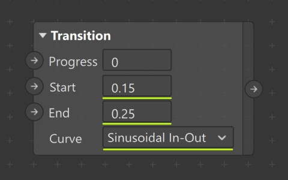
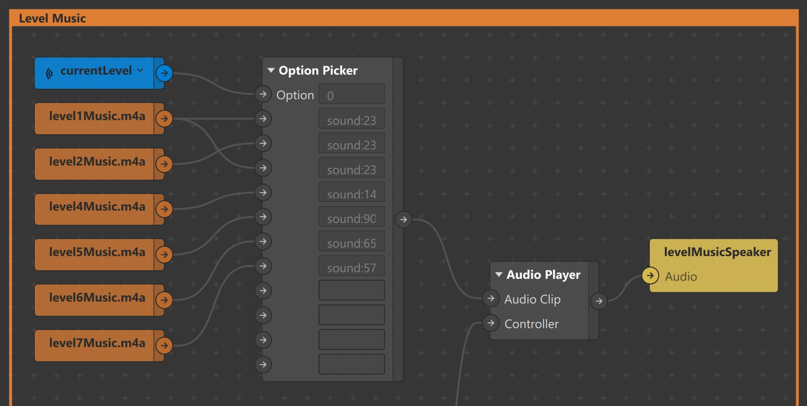
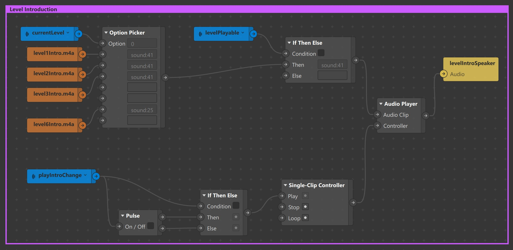

  
<p align="center">
  
</p>  

<p align="center">
  A Spark AR effect for  music lovers to learn, practise & perform beatboxing in a whole new way !
  <!-- <br>
  <br>
  <a href="https://github.com/twbs/bootstrap/issues/new?template=bug_report.md">Try it</a>
  ·
  <a href="https://github.com/twbs/bootstrap/issues/new?template=feature_request.md">Watch Demo</a>
  ·
  <a href="https://themes.getbootstrap.com/">Download</a>
  ·
  <a href="https://blog.getbootstrap.com/"></a>
</p> -->

## 1. Overview
 
 
[](https://www.youtube.com/watch?v=zv7Uvo3tv7Y)


The effect can recognize following sounds:

| # | Name |Equivalent Beatbox Sound  | Denoted By | 3D Object| Color |
| --- | --- | --- | --- | ---| --- |
| 1 | Kick Drum |[Listen](files/sounds/k.mp3) | **k**  | Cube |   `#ff55ff`|
| 2 | Snare |[Listen](files/sounds/s.mp3) | **s**  | Tetrahedron|  `#aaff00`|
| 3 | Hi-Hat |[Listen](files/sounds/h.mp3) | **h**  | Cylinder |  `#55ffff` |

In this step-by-step tutorial, you will be creating the above effect and by the end of it, you will be familiar with using:

* **Audio Analyzer** patch and **Script** to split microphone audio into bands and differentiate sounds.

* **Shaders** patches to transform **Camera Texture** & **Materials** based on signals from **Audio Analyzer**.

* **Native UI Picker** items as levels to gamify the effect.

* **JSON** data to indicate sounds and create new levels for the effect.


## 2. Prerequisites

Following is an Advanced tutorial for Spark AR Creators who have some experience in building complex effects. Please familiarize yourself with the following concepts before proceeding.

- [Audio Playback Controller](https://sparkar.facebook.com/ar-studio/learn/tutorials/audio-basics)

- [Energy Meter and Audio Analyzer Patches](https://sparkar.facebook.com/ar-studio/learn/tutorials/energy-meter-audio-analyzer)

- [Lights](https://sparkar.facebook.com/ar-studio/learn/tutorials/positioning-lights)

- [Native UI Slider](https://sparkar.facebook.com/ar-studio/learn/tutorials/native-ui-slider)

- [Particle Systems](https://sparkar.facebook.com/ar-studio/learn/tutorials/adding-particle-systems)

- [Scripting](https://sparkar.facebook.com/ar-studio/learn/tutorials/scripting)
    - [Script to Patch Bridging](https://sparkar.facebook.com/ar-studio/learn/patch-editor/bridging)
    
    - [Native UI Picker](https://sparkar.facebook.com/ar-studio/learn/tutorials/native-ui-picker#scripting)

    - [AudioModule](https://sparkar.facebook.com/ar-studio/learn/reference/classes/audiomodule)

    - [AnimationModule](https://sparkar.facebook.com/ar-studio/learn/reference/classes/animationmodule)

    - [PersistenceModule](https://sparkar.facebook.com/ar-studio/learn/reference/classes/persistencemodule)

    - [TimeModule](https://sparkar.facebook.com/ar-studio/learn/reference/classes/timemodule)


## 3. Downloading the project

To follow this tutorial, [download sample content](sample/sample_content.zip) and open the unfinished effect in [Spark AR Studio v97 and above.](https://sparkar.facebook.com/ar-studio/download/) All the required assets have already been imported to help you get started.

## 4. Understanding the Assets


### 4.1 Patch Assets

All Patch Assets except **Circle** & **Custom Ripple Animation** are imported from Spark AR Library.

| # |  Name | Patch Image  | Sample Output |
|--- | --- | --- | --- |
| 1 | **4 Colors Gradient** |   |  |
| 2 | **Circle** |   |  |
| 3 | **Adjust Colors**|  |   |
| 4 | **Custom Ripple Animation**|    | |
| 5| **Grid**|  |  |
| 6| **RGB Shift Shader**|    |   |
 
### 4.2 3D Shapes

Following 3D Shapes are imported from the library.


### 4.3 Textures

| Textures | Usage |
| --- | --- |
|    | **[lock](files/screenshots/lock.png)** is used in Native UI picker to denote levels which are yet to be unlocked by the user. ||
|    | **l1, l2, l3, l4, l5 & l6** are used in Native UI picker to denote levels already unlocked by the user. |
|   | **cameraTexture**  is transformed by **Shaders** patches based on audio signals. |
|    | **[dot](files/screenshots/dot.jpg)** is used by **scoreBackgroundMaterial** to create circular background. |
|    | **kickDrumHitTexture, snareHitTexture, hiHatHitTexture** is used by material to indicate that a **3D Object** was hit.|

### 4.4 Audio & Playback Controllers

Audio files are categoried into:
- **Instruction Audio**: Used to guide users.([level1Intro.m4a](files/sounds/level1Intro.m4a),[level2Intro.m4a](files/sounds/level2Intro.m4a),[level3Intro.m4a](files/sounds/level3Intro.m4a))
- **Level Audio**: Background music played for each level.([arl_mus_FloatingParticles_lp_01.m4a](files/sounds/arl_mus_FloatingParticles_lp_01.m4a),[arl_mus_FloatingParticles_lp_02.m4a.m4a](files/sounds/arl_mus_FloatingParticles_lp_02.m4a.m4a),[level4Music.m4a](files/sounds/level4Music.m4a),[level5Music.m4.m4a](files/sounds/level5Music.m4a))
- **Level Unlock Audio**: Played when user unlocks a level. [levelUnlocked.m4a](files/sounds/levelUnlocked.m4a)


**unlockAudioPlaybackController** is used to play [levelUnlocked.m4a](files/sounds/levelUnlocked.m4a) from script.


## 5. Creating Layers & Scene Elements
 
### 5.1 Layers

A total of three layers are used to render objects in the scene.


  
Go to **Layers** panel, create three layers and rename them to **topLayer**, **middleLayer** & **bottomLayer**. Make sure the layers are arranged in the same order as shown in the image.

### 5.2 Score

  
1. In the **Scene** panel, create a new **Face Tracker** object. call it **faceTracker**.

2. Right-click on the **faceTracker** object > **Add** > Choose **Plane** from the list and call it **scoreBackgroundPlane**.

3. Update properties of **scoreBackgroundPlane** to:

    

4. In the **Scene** panel, Right-click on the **scoreBackgroundPlane** object > **Add** > Choose **3D Text** from the list and call it **scoreText**.

5. Update properties of **scoreText** to:

    

6. Select the **faceTracker** object and change its **Layer** to **middleLayer** in the Inspector. Proceed by selecting **Add Object and Children**. At this point, your project will look like this: 
    
    

The Score is currently positioned at the center of the screen. Using patches, it will be made to float on top of user's head. But before that, let's understand how  patches are organised in the project.

You will notice 6 **Comment Patches** of different color in the Patch Editor.
They are patches are used to organize patches into different categories.


| # | Name | Color  | Content | 
| --- | --- | --- | --- | 
| 1 | **Signal Senders** | Blue |  All **Sender** patches,**Variables From Script** patchSignal Senders and **Camera** patch |
| 2 | **Level Music** | Orange | Patches required to play **Level Audio**  |
| 3 | **Level Introduction** | Purple | Patches required to play **Instruction Audio**  |
| 4 | **Microphone Audio** | Red | Patches required to split microphone audio into bands and boost frequencies  |
| 5 | **Triggered** | Yellow | Patches required to transform **Camera Texture** & **Materials** based on **Microphone Audio** |
| 6 | **Normal** | Green | Patches required to position and transform **Scene** elements  |


Make sure all the patches created in this section are placed inside the green **Normal Comment Patch** unless specified otherwise.

Now let's make the Score float on top of user's head.
 
1. Select **scoreBackgroundPlane**, go to Inspector and click on **Actions**. 

    

2. From the dropdown, select **Animate** > **Float**. This will open up the Patch Editor and automatically create patches required to make the **scoreBackgroundPlane** float. 

4. Edit values of **Transition** Patch to reduce the range of motion of **scoreBackgroundPlane**. 
     

    
 
### 5.3 Grid Plane


 The flat horizontal surface on which 3D objects slide is called Grid Plane.

1. Create a new **Plane** object and call it **gridPlane**.
2. Update properties of **gridPlane** to:
    
    
    
    At this point, your project will look like this:

    


Now, Let's generate grid pattern, animate and assign it as texture to **gridMaterial**.
 
1. Locate the **Grid** patch  in the **Assets** panel. Drag and Drop it inside the Patch Editor.

    

2. Edit values of **Grid** patch,  Set
      * **Color A** to **#000000**
      * **Color B** to **#000000**, also set value of **Alpha Channel** to **0**
      * **Size X** & **Size Y** to **12**
      * **Shift X** to **0.3**
      * **Rotation** to **45**

4. Connect **Grid** patch output to **Diffuse Texture** of **gridMaterial** patch. Grid pattern will now be visible on simulator.

5. Create a **Loop Animation** patch and a **Transition** patch to animate Grid pattern. 

6. Set **End** value of **Transition** patch to **1.4**

7. Reduce **Duration** of **Loop Animation** patch to **0.6**.

8. Connect 
    * **Progress** output of **Loop Animation** patch to **Progress** input of **Transition** patch.
    * Output of **Transition** patch to **Shift Y** port of **Grid** patch.

9. Next, we need logic to enable/disable Grid Animation, as and when user starts/stops recording video.

    

10. In the **Scene** panel, select **Camera** object, drag and drop it inside the Patch Editor to create **Camera** patch. Make sure it is placed inside the blue **Signal Senders Comment** patch.

11. Create a new **Sender** patch and call it  **videoRecording**. Connect **Video Recording** output of **Camera** patch to input of **videoRecording** **Sender** patch.

12. Use a **Receiver** patch to receive **videoRecording** signal and connect it to  **Enable** input port of  **Loop Animation** patch.

    

13. Use a **Delay** patch to enable Grid Animation after a delay **0.8** seconds from the time user starts recording video.
 
Now, Let's orient **gridPlane** according to user's head rotation in the **Z** axis

1. Select **faceTracker** object, drag and drop it inside the Patch Editor.

    
 
3. We want **gridPlane** to react only to the head movement made by the user in the **Z** axis. So we will **Unpack** the **3D Rotation** output 
from the **faceTracker** patch and perform some calculations on it before connecting it to **gridPlane**.

4. Connect the **Z** output of **Unpack** patch to a **Divide** patch. Change **denominator** value of **Divide** patch to **8**. This will make **gridPlane** less sensitive to head rotation.

5. Create a **Pack** patch of type **Vector3** and Set value of the first vector to **-90**

6. Connect 
    * Output port of **Divide** patch to third input port of  **Pack** patch.
    
    * Output port of **Pack** patch to **3D Rotation** input port of **gridPlane**. At this point, your project will look like this:

    

 
### 5.4  Platform


Platform contains 4 **Plane** objects called **spotLightPlane**, **kickDrumHitCircle**, **hiHatHitCircle** & **snareHitCircle** nested inside a **Null Object** called **platform**. 

1. In the **Scene** panel, create a new **Null Object** object and call it **platform**.

2. Right-click on **platform** object > **Add** > Choose **Plane** from the list and call it **spotLightPlane**. This is the transparent flat surface on which we will shine **Spot Lights** later.

3. Update properties of **spotLightPlane** to:

    
 
  

4. Right-click on the **platform** object > **Add** > Choose **Plane** from the list and call it **kickDrumHitCircle**.

5. Repeat **Step 4** twice and create **hiHatHitCircle** & **snareHitCircle**.

6. With **kickDrumHitCircle**, **hiHatHitCircle** & **snareHitCircle** selected, In the Inspector, Set:

    

7. With the **hiHatHitCircle** selected, set the **Position** value of **X** to **-0.1** in the inspector.

8. With the **snareHitCircle** selected, set the **Position** value of **X** to **0.1**.

9. Select the **platform** object and change its **Layer** to **topLayer**.

Generate circle texture and assign it to **circleMaterial**.
 
1. Locate **Circle** patch  in the **Assets** panel. Drag and Drop it inside the Patch Editor.

    

3. Connect output of **Circle** patch to the **Diffuse Texture** port of **Circle** patch. Circle pattern will now be visible in the simulator.

Animate circles to rotate in **Y** axis as soon as the user starts recording video. For this, use **videoRecording** Receiver patch from the previous section.

1. Create a **Loop Animation** patch and a **Transition** patch. 

    

2. Edit values of **Transition** patch,  
    
    
 
4. Connect 
    * The output of the **videoRecording** Receiver patch to the **Enable** input port of **Loop Animation** patch.
    * The **Progress** output of **Loop Animation** patch to the **Progress** input of **Transition** patch.
    * The output of **Transition** patch to the **3D Rotation** input port of **kickDrumHitCircle**, **hiHatHitCircle** & **snareHitCircle**. At this point, your project will look like this:

        

### 5.5 Lights 


The effect has a **Point Light**, a **Directional Light** and **3 Spot Lights**.

1. In the **Scene** panel, create a new **Point Light** object and call it **pointLight**.

2. Update properties of **pointLight** to:

     

3. Create a new **Directional Light** object and call it **directionalLight**.

4. Update properties of **directionalLight** to

      

5. We want the **platform** objects to be illuminated only by  **Spot Lights**. Since all objects of **platform** are in the **topLayer**, we will **Exclude** it from receiving **Point Light** & **Directional Light**.  
With both **pointLight** & **directionalLight** selected, In the Inspector,Under **Exclude**, Select **topLayer** from the dropdown.

6. Create **3** **Spot Light** object and rename them to **kickDrumSpotLight**, **hihatSpotLight**, **snareSpotLight**. 

8. Update properties of **kickDrumSpotLight** to:
    
    

9. Update properties of **hihatSpotLight** to:
    
    

10. Update properties of **snareSpotLight** to:
    
    

11. Select  **pointLight**, **directionalLight**, **kickDrumSpotLight**, **hihatSpotLight** & **snareSpotLight** object and change its **Layer** to **middleLayer** in the Inspector. At this point, your project will look like this:

        

Now let's make **Spot Lights** float in such a way that the diameter of the light beam illuminating the **platform** changes sinusoidally.

1.  Select  **kickDrumSpotLight**, **hihatSpotLight** & **snareSpotLight** in the **Scene** panel, and click the arrow next to **Position** in the Inspector. This will create three yellow patch representing **Position** property of each object.

        

2. Create a **Loop Animation** patch and a **Transition** patch to animate **Spot Lights** to float. 

3. Edit values of **Transition** patch
  
    

4. Create 3 **Pack** patches of type **Vector3** (one for each **Spot Light**).
  
6. Edit the values of **Pack** patches. 
    
    

8. Connect 
    * **Progress** output of **Loop Animation** patch to  **Progress** input of **Transition** patch.
    * Output port of **Transition** patch to **Y** input ports of all 3 **Pack** patches.
    * Output port of **Pack** patch to **3D Position** input port of **kickDrumSpotLight**, **hihatSpotLight** & **snareSpotLight**. At this point, your project will look like this:

        

### 5.6 3D Models 


1. In the **Scene** panel, create a new **Null Object** object and call it **3dModels**.

2. Locate **Cube**, **Tetrahedron** & **Cylinder** 3D model present in **Assets** panel. Drag and Drop them into the **Scene** panel and place them inside **3dModels** object. 

3. Now, exapand the **Cube** object and locate **Cube** Mesh. Click and drag the **Cube** Mesh and make it a direct child of **3dModels**. This makes it easier to change the **Material** of the **Cube** Mesh from the Script. You can retain **Cube** Mesh and delete the **Cube** object. Rename **Cube** Mesh to **Cube1**. 

    
4. Repeat the previous step for **Tetrahedron Mesh** and **Cylinder Mesh**.
4. Update properties of **cube1** to:

     

5. Update properties of **snare1** to:
   
   

5. Update properties of **cylinder1** to:
    
    

<!-- Names may have to be changed -->
8.  Select  **cube1**, **tetrahedron1** & **cylinder1** in the **Scene** panel, and press **Ctrl** + **D** four times to duplicate them.

   :warning: Do not use **Copy** +  **Paste** in this step. It will create a new material for every new object. On the other hand **Ctrl** + **D** creates a copy of the object but assignes the material of the original object to the duplicate object.

9. Select **3dModels** object and change its **Layer** to **middleLayer** in the Inspector. At this point, your project will look like this:

    

Use output of **4 Colors Gradient** patch as texture of **kickDrumMaterial**, **snareMaterial** and **hiHatMaterial**.

1. Locate **4 Colors Gradient** patch in **Assets** panel. Drag and Drop it inside the Patch Editor.


2. Set **Rotation** value of **4 Colors Gradient** patch to **45**.

3. Connect the output of **4 Colors Gradient** patch to the **Diffuse Texture** port of **kickDrumMaterial**, **snareMaterial** and **hiHatMaterial**.

    

### 5.7 Confetti


The effect uses two **Particle Systems** to create Confetti. They are triggered from script as soon as the user unlocks a level.

1. Create two new **Particle Systems** objects and rename them to **confettiYellow** and  **confettiGreen**.

2. In the Inspector, Set **confettiYellowMaterial** and **confettiGreenMaterial** as materials for **confettiYellow** and **confettiGreen** respectively.

3. There are several ways of configuring the **Particle Systems**. You can proceed with the values provided below or experiment with your own values.

    

3. Once you are satisfied with the configuration of **Particle Systems**, set **Birthrate** to **0** so that it can be triggered from script as soon as user unlocks a level.

### 5.8 Speakers 

The effect uses 4 **Speaker** objects.

| # | Name | Usage | Source \| Controlled by  |
| --- | --- | --- | --- |
| 1 | userSpeaker | Playing Microphone audio| Patches |
| 2 | unlockSpeaker | Playing Level Unlock audio| unlockAudioPlaybackController through Script |
| 3 | levelMusicSpeaker | Playing Level audio | Patches |
| 4 | levelIntroSpeaker | Playing Instruction audio | Patches |


1. In the **Scene** panel, create a new **Null Object** object & call it **speakers**.

2. Right-click on **speakers** object > **Add** > Choose **Speaker** from the list. Repeat this step until you have 4 **Speaker** objects in total.

3. Rename **Speaker** objects to **userSpeaker**, **unlockSpeaker**, **levelMusicSpeaker** & **levelIntroSpeaker**.

4. With the **unlockSpeaker** selected, In the Inspector, change the **Audio** source to **unlockAudioPlaybackController**.

5. **Audio** source for the remaining **speakers** will be provided using patches in the next section.
 
### 5.9 Canvas

 
1. In the **Scene** panel, create a new **Canvas** object & call it **canvas**.

2. Select **canvas** object and change its **Layer** to **middleLayer** in the Inspector.

3. Right-click on **canvas** object > **Add** > Choose **Rectangle** from the list. Repeat this step once again. 
 
4. Rename **Rectangle** objects to **progressBarRectangle** & **userRectangle**.

5. Update properties of **progressBarRectangle** to:

    
    

6. Uncheck the **Visible** property of **progressBarRectangle** so that it can be controlled from script.

7. Update properties of **userRectangle** to:

    


At this point, you may not notice any difference in the effect with or without the **userRectangle**. This is because, **cameraTexture** has been assigned as **Texture** of **userMaterial**. Using patches, we will be performing color manipulations to **cameraTexture** in the next section.

### 5.10 Ripple Planes


Ripple Planes consists of three **Plane** objects called **kickDrumRipplePlane**, **snareRipplePlane** & **hiHatRipplePlane**.

1. In the **Scene** panel, create a new **Null Object** object & call it **ripplePlanes**.

2. Right-click on **ripplePlanes** object > **Add** > Choose **Plane** from the list. Repeat this step twice. 

3. Rename **Rectangle** objects to **kickDrumRipplePlane**, **snareRipplePlane** & **hiHatRipplePlane**.

4. Update properties of **kickDrumRipplePlane**, **snareRipplePlane** & **hiHatRipplePlane** to:

    
    
    

5. In the Inspector, Set **kickDrumRippleMaterial**, **snareRippleMaterial** and **hiHatRippleMaterial** as materials for **kickDrumRipplePlane**, **snareRipplePlane** & **hiHatRipplePlane** respectively. We will be assigning **Textures** to these material in the next section. At this point, your project will look like this: 

    
  
## 6. Bridging Patch Editor & Script 

### 6.1 Creating Variables

**Variables to Script :**

We will be passing two types of variables from Patch Editor to Script.

* **recording** is a **Boolean** variable that indicates whether the user has started recording video or not.

* **band1**, **band4**, **band7**  are a **Number** variables used to determine the Signal Power of **Kick Drum**, **Snare** & **Hi-Hat** present in **Microphone Audio**. Signals will be assigned to these variables in the next section.

Select **Script** file in the **Assets Panel** and create the following variables in the **Inspector Panel**.


**Variables from Script :**

Following variables received from **Script**.


| # | Name | Type  | Purpose |
| --- | --- | --- | --- | 
| 1 | **currentLevel**  | **Number** | Indicates the current level the user has selected from the **Native UI Picker** |
| 2 | **soundType**  | **Number**  |  Indicates the type of sound (KICK: 0, SNARE: 1, HIHAT: 2) detected in the **Microphone Audio**  |
| 3 |  **rippleStatus**  | **Boolean** |  Used to enable/disable **Custom Ripple Animation** patch. Value becomes true whenever a sound (KICK, SNARE, HIHAT) detected in the **Microphone Audio** exceeds the threshold value  |
| 4 | **playIntroChange**  | **Boolean** |  Negated whenever the user selects a different level using the **Native UI Picker**. This variable will be used to trigeer the controller that plays **Level Audio Instruction**  |
| 5 | **levelPlayable**  | **Boolean** | Indicates whether the user has unlocked the level that is currently selected on the **Native UI Picker**  | 
 
Select **Script** file in the **Assets Panel** and create the following variables in the **Inspector Panel**.


### 6.2 Analyzing Microphone Audio and Assigning Signals to Script Variables


1. From the **Scene** Panel, drag and drop the **Microphone** object into the Patch Editor and place it inside the red **Microphone Audio** Comment Patch.

2. Use a **Denoiser** patch to reduce background noise. Set the **Amount** value to **50**.

    

3. Next, connect output of **Denoiser** to a **Audio Analyzer** patch. Obtain Signal Power of **Band 1**, **Band 2** & **Band 3** and pass them as **Variables To  Script**.

4. Connect **Audio** output from **Audio Analyzer** patch to **Audio** input of **Parametric Equailizer** patch. 

5. Set values of **Parametric Equailizer** patch to the following. This will boost bass frequencies of the **Microphone** audio without altering the treble frequencies.

    

6. Add **Slider UI** patch and a **To Range** patch to control the amount of **Low Gain** between **0** to **24**. This will allow user to decide the amount of bass boost from the **Native UI slider**

7. Connect output of **Parametric Equailizer** to **Audio** input of **userSpeaker** patch.

## 7. Scripting

Add the following capabilities to your project.
* **Native UI Picker** under **Native UI Control**.

* **Persistence** (Add **data** to **Whitelisted keys**).
 
### 7.1 Importing Modules
 
```javascript
// Import all the required modules.

const Time = require('Time'); // To keep track of Time and trigger animations accordingly
const Audio = require('Audio'); // To play Level Unlock Audio
const Scene = require('Scene'); // To import Scene Elements 
const Patches = require('Patches'); // To exchange data between to Patch Editor and Script
const NativeUI = require('NativeUI'); // To create Native UI Picker
const Textures = require('Textures'); //  To import textures required by Native UI Picker 
const Animation = require('Animation'); // To Animate cubes, cylinders & tetrahedrons
const Materials = require('Materials'); // To import hit Materials 
const Persistence = require('Persistence'); // To store max level unlocked by the user
export const Diagnostics = require('Diagnostics'); // To debug code
```
**Level JSON**

**Level JSON** is used to configure each level. It's structure is as follows.
* **level_X** indicates the level number or (index+1) of item selected in Native UI picker. Ex:```"level_1"```
    * **duration** of the entire level indicated in milli seconds. Ex:```"duration": 38000```
    * **minscoreText** indicates the min score user requires to unlock next level. Ex:```"minscoreText": 25```
    * **Time** & **Sound Letter** indicates the instance in time at which the animation of **3D Object** corresponding to the specified **Sound Letter** should start. Ex:```"1.0": ["k"]```

```javascript
{
    "level_1": 
    {
        "duration": 38000,
        "minscoreText": 25,
        "1.0": ["k"],
        "2.0": ["k"],
        "3.5": ["h"],
        "5.0": ["k"]
    },
    "level_2": 
    {
        "duration": 29000,
        "minscoreText": 22,
        "1.0": ["k"],
        "1.7": ["k"],
        "2.0": ["s"],
        "3.0": ["k"],
        "3.7": ["k"],
        "4.0": ["s"],
        "5.0": ["k"]
    }
}        
```

JSON data can be stored in the same **script.js** file or externally in  different .js file which can be imported into **script.js** using ```const levelJson = require("./filename");``` 

To add a new level, modify **Level JSON** and configuration of **Native UI Picker**. 

### 7.2 Importing Objects

Use **Promise** inside the **Asynchronous** function to import all the required **Scene objects**, **Textures**, **AudioPlaybackController**, **Materials** and **Variables** passed from Patch Editor. Assign them to array of variables.

```javascript
/* ... Truncated Imported Modules */

(async function () {

    const [cube1, cube2, cube3, cube4, cube5, cylinder1, cylinder2, cylinder3, cylinder4, cylinder5, tetrahedron1, tetrahedron2, tetrahedron3, tetrahedron4, tetrahedron5, band1, band4, band7, scoreText, l1, l2, l3, l4, l5, l6, l7, l8, l9, l10, lockTexture, recording, scoreContainer, progressBarRectangle, confettiYellow, confettiGreen, unlockAudioPlaybackController, kickDrumMaterial,snareMaterial,hiHatMaterial, kickDrumHitMaterial,snareHitMaterial,hiHatHitMaterial] = await 

    Promise.all([
        Scene.root.findFirst('cube1'),
        Scene.root.findFirst('cube2'),
        Scene.root.findFirst('cube3'),
        Scene.root.findFirst('cube4'),
        Scene.root.findFirst('cube5'),
        Scene.root.findFirst('cylinder1'),
        Scene.root.findFirst('cylinder2'),
        Scene.root.findFirst('cylinder3'),
        Scene.root.findFirst('cylinder4'),
        Scene.root.findFirst('cylinder5'),
        Scene.root.findFirst('tetrahedron1'),
        Scene.root.findFirst('tetrahedron2'),
        Scene.root.findFirst('tetrahedron3'),
        Scene.root.findFirst('tetrahedron4'),
        Scene.root.findFirst('tetrahedron5'),
        Patches.outputs.getScalar("band1"),
        Patches.outputs.getScalar("band4"),
        Patches.outputs.getScalar("band7"),
        Scene.root.findFirst('scoreText'),
        Textures.findFirst('l1'),
        Textures.findFirst('l2'),
        Textures.findFirst('l3'),
        Textures.findFirst('l4'),
        Textures.findFirst('l5'),
        Textures.findFirst('l6'),
        Textures.findFirst('l7'),
        Textures.findFirst('l8'),
        Textures.findFirst('l9'),
        Textures.findFirst('l10'),
        Textures.findFirst('lockTexture'),
        Patches.outputs.getBoolean("recording"),
        Scene.root.findFirst('scoreContainer'),
        Scene.root.findFirst('progressBarRectangle'),
        Scene.root.findFirst('confettiYellow'),
        Scene.root.findFirst('confettiGreen'),
        Audio.getAudioPlaybackController('unlockAudioPlaybackController'),
        Materials.findFirst("kickDrumMaterial"),
        Materials.findFirst("snareMaterial"),
        Materials.findFirst("hiHatMaterial"),
        Materials.findFirst("kickDrumHitMaterial"),
        Materials.findFirst("snareHitMaterial"),
        Materials.findFirst("hiHatHitMaterial"),        
    ]);
})();    
```
### 7.3 Native UI Picker & PersistenceModule

In this section, you will:
* Set up the configuration for **Native UI Picker**.

* Assign textures to items of picker based on level data from **PersistenceModule**.
* Subscribe to **selectedIndex** property of the picker.
* Pass values from Script to Patch Editor.

```javascript
/* ... Truncated Imported Modules */

(async function () {

    /* ... Truncated Promise */

    //==============================================================================
    // Native UI Picker variables
    //==============================================================================

    // Store reference to Native UI Picker
    const picker = NativeUI.picker; 

    // Initialize to Level 1
    let currentSelectedIndex = 0; 
    
    let configuration = {
        selectedIndex: 0,
        items: [
            { image_texture: l1 },
            { image_texture: lockTexture },
            { image_texture: lockTexture },
            { image_texture: lockTexture },
            { image_texture: lockTexture },
            { image_texture: lockTexture },
            { image_texture: lockTexture },
            { image_texture: lockTexture },
            { image_texture: lockTexture },
            { image_texture: lockTexture }
        ]
    };

    // Icons of all levels assigned to an array 
    let levelIcons = [l1, l2, l3, l4, l5, l6, l7, l8, l9, l10]; 
    
    // Negated whenever user selects a new item from Native UI picker
    var playIntroChange = false;

    //==============================================================================
    // Persistence variables
    //==============================================================================

    // Store a reference to the userScope
    const userScope = Persistence.userScope; 
    
    // JavaScript object to store the data
    const data = { level: 0 }; 
    
    // Max level unlocked by the user
    var maxLevelUnlocked = 0; 

    //==============================================================================
    // Fetch Max Unlocked Level from stored data
    //==============================================================================
  
    try {
        
        // Attempt to get the stored data and if successful
        const result = await userScope.get('data');
        
        // Assign the obtained level data to maxLevelUnlocked
        maxLevelUnlocked = parseInt(result.level.toString());   
       
        // Loop through all the items of Native UI picker and assign respective levelIcons as textures to unlocked levels
        for (let index = 0; index <= result.level; index++) {
            configuration.items[index] = { image_texture: levelIcons[index] };
        }

    } catch (error) {

        // If not successful, then the value of maxLevelUnlocked is its default value which is 0.
        Diagnostics.log('Failed to retrieve data, ' + error);
    }

    // Configure Native UI Picker and display it
    picker.visible = true;
    picker.configure(configuration);
 
    //==============================================================================
    // Monitor changes to selectedIndex of picker
    //==============================================================================
   
    picker.selectedIndex.monitor().subscribe(function (selectedIndex) {
        
        // Value of playIntroChange is negated and sent to the Patch Editor
        playIntroChange = !playIntroChange;
        Patches.inputs.setBoolean("playIntroChange",playIntroChange);

        //Index of newly selected item is assigned
        currentSelectedIndex = selectedIndex.newValue;
 
        // Value of levelPlayable is determined based on the levels unlocked by the user and sent to the Patch Editor
        Patches.inputs.setBoolean("levelPlayable",currentSelectedIndex <= maxLevelUnlocked?true:false);
    });

    //Changes to index of newly selected item is sent to the Patch Editor
    Patches.inputs.setScalar("currentLevel", picker.selectedIndex);

})();    
```

### 7.4 Progress Bar & Confetti

In this section, you will:
* Set up **Animation Driver** variables of **Progress Bar**.

* Monitor whether the user has started recording video and based on this
    
    * Reset **Confetti**, **Score** & **unlockAudioPlaybackController**.

    * Hide **Native UI Picker**.

    * Initialize **ProgressBar** **Animation Driver** & start animation.

```javascript
/* ... Truncated Imported Modules */

(async function () {

    /* ... Truncated Promise & Variable Declaration Code */

    //==============================================================================
    // ProgressBar & Score variables
    //==============================================================================

    // timeDriver to control ProgressBar Animation
    var progressBarRectangleDrivers; 

    // durationMilliseconds will be set from level data
    var progressBarRectangleDriverParameters = {
        durationMilliseconds: 0,
        loopCount: 1,
        mirror: false
    };

    var progressBarRectangleSampler;
    
    // Current score value
    var scoreTextValue = 0; 

    /* ... Truncated Native UI Picker & PersistenceModule Code */

    //==============================================================================
    // Monitor whether the user is recording video
    //==============================================================================
    
    recording.monitor().subscribe(function (recordingEvent, snapshot) {
        
        // Value of levelPlayable is determined based on the levels unlocked by the user and sent to the Patch Editor
        Patches.inputs.setBoolean("levelPlayable",currentSelectedIndex <= maxLevelUnlocked?true:false);

        //Allow the user to proceed and play if the user has unlocked the selected level
        if( currentSelectedIndex <= maxLevelUnlocked)
        {
            //Allow user to proceed and play if the user has started recording video
            if (recordingEvent.newValue) {
            
            //==============================================================================
            // Reset UI & AudioPlaybackController
            //==============================================================================

            // Reset Confetti and hide them
            confettiYellow.birthrate = 0;
            confettiGreen.birthrate = 0;
            confettiYellow.hidden = true;
            confettiGreen.hidden = true;

            //Stop playing Level Unlock Music from previous levels
            unlockAudioPlaybackController.setPlaying(false);

            //Hide the Native UI Picker and rest score to 00
            picker.visible = false;
            scoreTextValue = 0;
            scoreText.text = "00";

            //==============================================================================
            // Prepare ProgressBar & start its Animation
            //==============================================================================

            // Configure the duration of progressBar to go from 100 to 0 based on the level   
            progressBarRectangleDriverParameters.durationMilliseconds = levelJson["level_" + (currentSelectedIndex+1)].duration;
            progressBarRectangleDrivers = Animation.timeDriver(progressBarRectangleDriverParameters);
            progressBarRectangleSampler = Animation.samplers.linear(100, 0);
            progressBarRectangle.width = Animation.animate(progressBarRectangleDrivers, progressBarRectangleSampler)
            progressBarRectangleDrivers.reset();
            progressBarRectangleDrivers.start();

            //Unhide progressBar
            progressBarRectangle.hidden = false;
     
            }
        }
    });
   
})();    
```

### 7.5 Initialize Animation Drivers of Cube, Tetrahedron & Cylinder

In this section, you will:
1. Set up **Animation Driver** variables of **Cube**, **Tetrahedron** & **Cylinder**.

1. Bind **Animation** to the z-axis position signal of **3D objects**. 

1. Subscribe to **onCompleted** event of the animation and reset properties of the corresponding **3D Object**
 
Since **3D objects** can't be created on runtime, we will have to deal with a limited number of **Cubes**, **Tetrahedrons** & **Cylinders**, all of which are created in the **Scene** Panel before runtime. We will have to use and reuse them.

While animating these limited number of **3D objects**, we will have ensure that a **3D object** does not get interrupted or reused until its animation is completed. To acheive this, we use Availability Arrays. 

In simple words, At any given point in time, Availability Arrays tell us which **3D objects** are idle.

As soon as an animation of a **3D object** begins, its availability is set to **false** in the Availability Arrays and is set back to **true** when the animation is completed.
```javascript
/* ... Truncated Imported Modules */

(async function () {

    /* ... Truncated Promise & Variable Declaration Code */
   
    //==============================================================================
    // Cube, Cylinder & Tetrahedron Animation variables
    //==============================================================================
 
    // 3D objects Animation paramters
    const timeDriverParameters = {
        durationMilliseconds: 4000,
        loopCount: 1,
        mirror: false
    };

    // Animate 3D objects in Z Axis, starting at -1.8 and ending at 0.15 in 4 seconds
    const linearSampler = Animation.samplers.linear(-1.8, 0.15);

    // Array to store & access cubeTimeDrivers of each invidual cube, cylinder & tetrahedron using index
    let cubeTimeDrivers = []; 
    let cylindersTimeDrivers = [];
    let tetrahedronsTimeDrivers = [];
    
    // Array to store & access each invidual cube using index
    const cubes = [cube1, cube2, cube3, cube4, cube5];  
    // Array to track Availability of cubes
    const cubesAvailability = [true, true, true, true, true]; 

    // Array to store & access each invidual cylinder using index
    const cylinders = [cylinder1, cylinder2, cylinder3, cylinder4, cylinder5]; 
    // Array to track Availability of cylinders
    const cylindersAvailability = [true, true, true, true, true];

    // Array to store & access each invidual tetrahedron using index
    const tetrahedrons = [tetrahedron1, tetrahedron2, tetrahedron3, tetrahedron4, tetrahedron5];
    // Array to track Availability of tetrahedrons
    const tetrahedronsAvailability = [true, true, true, true, true];
  
    /* ... Truncated Native UI Picker & PersistenceModule Code */

    recording.monitor().subscribe(function (recordingEvent, snapshot) {
        
        /* ... Truncated Code */

        if( currentSelectedIndex <= maxLevelUnlocked)
        {
            if (recordingEvent.newValue) {
            
             /* ... Truncated Code */

             //
             
            //==============================================================================
            // Initialize Animation Drivers
            //==============================================================================
 
                // Check array length to determine if the driver was previously initialized
                if (cubeTimeDrivers.length == 0) {

                    // Loop through all the cubes
                    for (let index = 0; index < cubes.length; index++) {

                        // Create a new TimeDriver and push it into the array 
                        cubeTimeDrivers.push(Animation.timeDriver(timeDriverParameters))
                        
                        // Create a new animation using the TimeDrivers &  linearSampler. 
                        // Bind it to the z-axis position signal of the cube
                        cubes[index].transform.z = Animation.animate(cubeTimeDrivers[index], linearSampler)
                        
                        // Hide the cube until the animation begins
                        cubes[index].hidden = true;

                        // Once the animation it completed, 
                        // Reset the availability to true
                        // Reset to original scale, material and hide it
                        cubeTimeDrivers[index].onCompleted().subscribe(function (event) {
                            cubesAvailability[index] = true;
                            cubes[index].transform.scaleX = 0.5;
                            cubes[index].transform.scaleY = 0.5;
                            cubes[index].material = kickDrumMaterial;
                            cubes[index].hidden = true;

                        });

                    }

                    // Loop through all the cylinders
                    for (let index = 0; index < cylinders.length; index++) {

                        // Create a new TimeDriver and push it into the array 
                        cylindersTimeDrivers.push(Animation.timeDriver(timeDriverParameters))
                        
                        // Create a new animation using the TimeDrivers &  linearSampler. 
                        // Bind it to the z-axis position signal of the cylinder
                        cylinders[index].transform.z = Animation.animate(cylindersTimeDrivers[index], linearSampler)
                        
                        // Hide the cube until the animation begins
                        cylinders[index].hidden = true;

                        // Once the animation it completed, 
                        // Reset the availability to true
                        // Reset to original scale, material and hide it
                        cylindersTimeDrivers[index].onCompleted().subscribe(function (event) {
                            cylindersAvailability[index] = true;
                            cylinders[index].transform.scaleX = 0.5;
                            cylinders[index].transform.scaleY = 0.3;
                            cylinders[index].material = hiHatMaterial;
                            cylinders[index].hidden = true;

                        });

                    }

                    // Loop through all the tetrahedrons
                    for (let index = 0; index < tetrahedrons.length; index++) {

                        // Create a new TimeDriver and push it into the array 
                        tetrahedronsTimeDrivers.push(Animation.timeDriver(timeDriverParameters))
                        
                        // Create a new animation using the TimeDrivers &  linearSampler. 
                        // Bind it to the z-axis position signal of the tetrahedron
                        tetrahedrons[index].transform.z = Animation.animate(tetrahedronsTimeDrivers[index], linearSampler)
                        
                        // Hide the cube until the animation begins
                        tetrahedrons[index].hidden = true;
                        
                        // Once the animation it completed, 
                        // Reset the availability to true
                        // Reset to original scale, material and hide it
                        tetrahedronsTimeDrivers[index].onCompleted().subscribe(function (event) {
                            tetrahedronsAvailability[index] = true;
                            tetrahedrons[index].transform.scaleX = 0.8;
                            tetrahedrons[index].transform.scaleZ = 0.8;
                            tetrahedrons[index].material = snareMaterial;
                            tetrahedrons[index].hidden = true;

                        });

                    }

                }  
     
            }
        }
    });
   
})();   
```
### 7.6 Animating 3D Objects based on Level Data
 
 
In this section, you will:
1. Read **levelJson** data and animate **3D Objects** accordingly.

2. Reset elements when a level has ended.
    
3. Unlock next level based on user's score and save progress using **PersistenceModule**.

```javascript
/* ... Truncated Imported Modules */

(async function () {

    /* ... Truncated Promise & Variable Declaration Code */
   
    //==============================================================================
    // Time variables
    //==============================================================================
    
    // Interval timer used to track time
    var intervalTimer;
 
    //Time elapsed since the user started recording video.
    var timeNow = 0;

    // Similar to timeNow, but store time as String data, rounded to 1 decimal point
    var currentTime;
     
    /* ... Truncated Native UI Picker & PersistenceModule Code */

    recording.monitor().subscribe(function (recordingEvent, snapshot) {
        
        /* ... Truncated Code */

        if( currentSelectedIndex <= maxLevelUnlocked)
        {
            if (recordingEvent.newValue) {
            
             /* ... Truncated Code */

             //Initialize Time to 0    
            timeNow = 0;
    
            //==============================================================================
            // Begin Selected Level
            //============================================================================== 
            
            //Interval timer to execute function every 0.1 sec or 100 ms
            intervalTimer = Time.setInterval(function () {
    
                    //Increase time by 0.1 because the function is called every 0.1 sec
                    timeNow = timeNow + 0.1;

                    //Round off timeNow to 1 decimal point Ex:1.59 becomes 1.5
                    currentTime = timeNow.toFixed(1);
    
                    //Check if levelJson has any sounds at a specific time. Ex:levelJson["level_1"][1.5]
                    if (levelJson["level_" + (currentSelectedIndex+1)][currentTime]) {
    
                        // Loop through all the sounds present at a specific time Ex: "1.0": ["k","h"]
                        levelJson["level_" + (currentSelectedIndex+1)][currentTime].forEach(sound => {
                             
                            let availableIndex;
    
                            // Based on the sound data from levelJson animate a cube/cylinder/tetrahedron.
                            switch (sound) {
                                case "k":
                                    
                                    //Locate the index of the first available cube
                                    availableIndex = cubesAvailability.indexOf(true);

                                    //Make it visible
                                    cubes[availableIndex].hidden = false;

                                    //Make it unavailable by setting its availability to false
                                    cubesAvailability[availableIndex] = false;

                                    //Start the Animation
                                    cubeTimeDrivers[availableIndex].reset();
                                    cubeTimeDrivers[availableIndex].start();
    
                                    break;
    
                                case "h":
    
                                    availableIndex = cylindersAvailability.indexOf(true);
                                    cylinders[availableIndex].hidden = false;
                                    cylindersAvailability[availableIndex] = false;
                                    cylindersTimeDrivers[availableIndex].reset();
                                    cylindersTimeDrivers[availableIndex].start();
    
                                    break;
    
                                case "s":
    
                                    availableIndex = tetrahedronsAvailability.indexOf(true);
                                    tetrahedrons[availableIndex].hidden = false;
                                    tetrahedronsAvailability[availableIndex] = false;
                                    tetrahedronsTimeDrivers[availableIndex].reset();
                                    tetrahedronsTimeDrivers[availableIndex].start();
    
                                    break;
                                
                            }
                        });
                    }
    
                    //==============================================================================
                    // End Selected Level if currentTime has exceeded the duration of the level
                    //============================================================================== 
            
                    // Check if currentTime has crossed the duration of the selected level
                    if ((parseFloat(currentTime) * 1000) > levelJson["level_" + (currentSelectedIndex+1)].duration) {

                        //Clear Timer to end level
                        Time.clearInterval(intervalTimer);

                        //Hide the progressBar & Native UI picker
                        progressBarRectangle.hidden = true;
                        picker.visible = true;

                        // Stop the progressBar's animation
                        progressBarRectangleDrivers.stop();
                        
                        // Check if the user has scored the minimum points required to unlock the next level
                        if (scoreTextValue >= levelJson["level_" + (currentSelectedIndex+1)].minscoreText) {
                            
                            // Update Persistence data if the next level has been unlocked

                            try {
                                maxLevelUnlocked = currentSelectedIndex + 1;
                                data.level = maxLevelUnlocked;
                                userScope.set('data', data);
    
                            } catch (error) {
                                // If not successful output a failure message with the error returned
                                Diagnostics.log('Failed to store, ' + error)
                            }
    
                            //Assign the respective levelIcon to the unlocked level item and update the Native UI Picker
                            configuration.items[currentSelectedIndex + 1].image_texture = levelIcons[currentSelectedIndex + 1];
                            configuration.selectedIndex = currentSelectedIndex;
                            picker.configure(configuration);

                            //Play unlock level audio
                            unlockAudioPlaybackController.reset();
                            unlockAudioPlaybackController.setPlaying(true);

                            //Unhide the confetti and increase its birthrate.
                            confettiYellow.hidden = false;
                            confettiGreen.hidden = false;
                            confettiYellow.birthrate = 30;
                            confettiGreen.birthrate = 30;
    
                        }
    
                    }
    
                }, 100);
     
    
            } else {
                
                //==============================================================================
                // End selected Level if user stops recording video
                //============================================================================== 
            
                //Clear Timer to end level
                Time.clearInterval(intervalTimer);
    
                //Hide the progressBar & Native UI picker
                picker.visible = true;
                progressBarRectangle.hidden = true;

                // Stop the progressBar's animation
                progressBarRectangleDrivers.stop();
    
                // Check if the user has scored the minimum points required to unlock the next level
                if (scoreTextValue >= levelJson["level_" + (currentSelectedIndex+1)].minscoreText) {
                    
                    //Assign the respective levelIcon to the unlocked level item and update the Native UI Picker
                    picker.configure(configuration);

                    //Play unlock level audio
                    unlockAudioPlaybackController.reset();
                    unlockAudioPlaybackController.setPlaying(true);

                    //Unhide the confetti and increase its birthrate.
                    confettiYellow.hidden = false;
                    confettiGreen.hidden = false;
                    confettiYellow.birthrate = 30;
                    confettiGreen.birthrate = 30;
    
                }
    
            }
        }
    });
   
})();   
```

### 7.7 Monitoring Signal Power, Differentiate Sounds and Identify Hits

In this section, you will:
1. **Monitor Signal Power**:Subscribe to changes in Signal Power of **band1** or **band4** or **band7** exceeding threshold of  **0.75**. Compare the Signal Power of the specific band with other bands at that instance and receive the result as Snapshot. 

2. **Differentiate Sounds**:Use the result from Snapshot to check for conditions and identify sound detected in the **Mircrophone Audio**
    
3. **Identify Hits**:A hit occurs when two conditions are satisfied:

    1. User produced a sound which was differentiated by the effect.

    2. **3D Object** corresponding to the sound was present on the platform at that very instance.

4. For every Identified hit, score is incremented.


```javascript
/* ... Truncated Imported Modules */

(async function () {

    /* ... Truncated Promise & Variable Declaration Code */
   
    //==============================================================================
    // Monitoring Signal Power, Detecting Sounds and Hits
    //==============================================================================
    
    // KICK DRUM
    // Subscribe to receive events when value of band1(Kick Drum) Signal Power has exceeded threshold value (Condition A)
    band1.gt(0.75).monitor().subscribeWithSnapshot(
        {
            // Check if band1(Kick Drum) Signal Power was greater than band4(Snare)  (Condition B)
            // Check if band1(Kick Drum) Signal Power has not exceeded threshold value (Condition C)
            "greaterThanSnare": band1.gt(band4),
            "snareBelowThreshold": band4.lt(0.75)
        }, function (event, snapshot) {

            // If Condition A, B & C are true then it is a confirmation that Kick Drum was detected.
            if (event.newValue && snapshot.greaterThanSnare && snapshot.snareBelowThreshold) {
                 
                // SoundType is set to KICK & sent to the Patch Editor
                Patches.inputs.setScalar("soundType",soundType.KICK);
 
                //Loop through all the cubes to determine if there is a cube present on top of the platform circle at that very instance
                for (let index = 0; index < cubes.length; index++) {

                    // Obtain the position of the cubes in the Z Axis
                    const z = cubes[index].transform.z.pinLastValue();

                    //Check if the cube's z values is within the platform range.
                    if (z > -0.3 && z < -0.1) {

                        // Hit is detected
                        // Reduce the scale of cube and change its material
                        Diagnostics.log("hit" + index + " " + z)
                        
                        cubes[index].transform.scaleX = 0.4;
                        cubes[index].transform.scaleY = 0.4;

                        cubes[index].material = kickDrumHitMaterial;

                        //Update the score
                        scoreTextValue++;
                        if (scoreTextValue < 10) {
                            scoreText.text = "0" + scoreTextValue;
                        } else {
                            scoreText.text = "" + scoreTextValue;
                        }

                        break;
                    }
                }

                //When condition Condition A, B & C are true, rippleStatus is set to true & sent to the Patch Editor
                Patches.inputs.setBoolean("rippleStatus",1);

            }

            
            if(!event.newValue)
            {   
                //When condition Condition A is false, rippleStatus is set to true & sent to the Patch Editor
                Patches.inputs.setBoolean("rippleStatus",0);

            }

        });


    // SNARE        
    band4.gt(0.75).monitor().subscribeWithSnapshot(
        {
            "greaterThanBass": band4.gt(band1),
            "bassBelowThreshold": band1.lt(0.75)
        }, function (event, snapshot) {

            if (event.newValue && snapshot.greaterThanBass && snapshot.bassBelowThreshold) {
                Patches.inputs.setScalar("soundType",soundType.SNARE);
 
                for (let index = 0; index < tetrahedrons.length; index++) {

                    const z = tetrahedrons[index].transform.z.pinLastValue();

                    if (z > -0.3 && z < -0.1) {
                        Diagnostics.log("hit" + index + " " + z)

                        tetrahedrons[index].transform.scaleX = 0.7;
                        tetrahedrons[index].transform.scaleY = 0.7;

                        tetrahedrons[index].material = snareHitMaterial;
                        scoreTextValue++;
                        if (scoreTextValue < 10) {
                            scoreText.text = "0" + scoreTextValue;
                        } else {
                            scoreText.text = "" + scoreTextValue;
                        }

                        break;
                    }
                }

                Patches.inputs.setBoolean("rippleStatus",1);

            }

            
            if(!event.newValue)
            {
                Patches.inputs.setBoolean("rippleStatus",0);

            }

        });

    // HI-HAT
    band7.gt(0.6).monitor().subscribeWithSnapshot(
        {
            "snareBelowThreshold": band4.lt(0.75)
        }
       ,function (event, snapshot) {

            if (event.newValue && snapshot.snareBelowThreshold) {
                
                Patches.inputs.setScalar("soundType",soundType.HIHAT);
                
                for (let index = 0; index < cylinders.length; index++) {

                    const z = cylinders[index].transform.z.pinLastValue();

                    if (z > -0.3 && z < -0.1) {
                        Diagnostics.log("hit" + index + " " + z)    
                        
                        cylinders[index].transform.scaleX = 0.4;
                        cylinders[index].transform.scaleZ = 0.4;

                        cylinders[index].material = hiHatHitMaterial;
                        scoreTextValue++;
                        if (scoreTextValue < 10) {
                            scoreText.text = "0" + scoreTextValue;
                        } else {
                            scoreText.text = "" + scoreTextValue;
                        }

                        break;
                    }
                }

                Patches.inputs.setBoolean("rippleStatus",1);

            }

            if(!event.newValue)
            {
                Patches.inputs.setBoolean("rippleStatus",0);

            }

        });
     
    /* ... Truncated Native UI Picker, PersistenceModule & Recording Monitor Code*/

})();   
```

## 8. Patch Editor

### 8.1 Signal Senders

Access variables sent from script to the Patch Editor.

1. Select the script file in the Assets Panel.
2. In the Inspector Panel, Select Create Producer Patch.
3. This will create a patch called **Variables From Script**. Place it inside the blue **Signal Senders** patch.
4. Create 5 **Sender Patches** and rename them to **currentLevel**, **soundType**, **rippleStatus**, **playIntroChange** & **levelPlayable**.
5. Connect each output from **Variables From Script** patch to the corresponding **Sender Patches**.


### 8.2 Level Music

Let's create patches required to play background music of each level.


1. Create Receiver Patch to obtain value of **currentLevel** . Connect it to **Option** input port of **Option Picker** patch of type **Text**.
 
2.  Locate the **abc. m4a**, **def. m4a** audio files present under **Audio** in the **Assets** panel. Drag and Drop them inside the Patch Editor. Connect output of each audio file patch to an input port of **Option Picker**.

    

3. Connect output of **Option Picker** patch to **Audio Clip** input of a new **Audio Player** patch. 

4. Next, create **Receiver Patches** to obtain values of **levelPlayable** and **videoRecording**. Use these values to Play/Stop **Single-Clip Controller** connected to **Audio Player**. 

    

7. Connect output of **Audio Player** to **Audio** input of **levelMusicSpeaker** patch.

8. Pass output of **videoRecording** patch as a **Variable To  Script** called **recording**.

### 8.3 Level Introduction

Let's create patches required to play **Level Introduction Audio** of unlocked levels as and when the user selects them on **Picker**.



1. Similar to **Level Music**, use **currentLevel** Receiver patch and **Option Picker** patch to pick **Instruction Audio**.

2. Before passing output of **Option Picker** patch to **Audio Player**, use an **If Then Else** patch & value of **levelPlayable** receiver patch to check whether the user has unlocked the selected level or not. This ensures that **Instruction Audio** of only the unlocked levels are played.

3. Use output from **playIntroChange** Receiver Patch to Play/Stop **Single-Clip Controller** connected to **Audio Player**. 

    

2. Connect output of **Audio Player** to **Audio** input of **levelIntroSpeaker** patch.

### 8.4 Triggered UI

Let's create patches to transform **Camera Texture** & **Materials**.


1. Locate **Custom Ripple Animation** patch in the **Assets** panel. Drag and Drop it inside the Patch Editor. Create two more copies of the same patch using **Ctrl+C** & **Ctrl+V**.
   
     

2. Set **Duration** of all the three  **Custom Ripple Animation** patches to **0.7** seconds.


3. Set **Color** value of first, second and third **Custom Ripple Animation** patches to **#ff55ff**, **#55ffff** & **#aaff00** respectively.

4. Try turning **On & Off** each **Custom Ripple Animation** patch to view them in Simulator.

5. Connect output of first, second and third **Custom Ripple Animation** patches to the **Diffuse Texture** port of **kickDrumRippleMaterial**, **snareRippleMaterial** and **hiHatRippleMaterial** respectively.

6. Create an **Option Sender** patch. Connect three of its outputs to  **On/Off** input port of each **Custom Ripple Animation** patch.

7. Connect output from **hitSoundType** & **rippleStatus** Receiver patches to **Option** input port and **Value** input port respectively. This way, whenever there is a change in  **rippleStatus**, corresponding **Custom Ripple Animation** will be turned **On/Off** based on the value of **hitSoundType**.

Now, perform color manipulations to **cameratexture** based on the values of **hitSoundType** & **rippleStatus**. 

1. Locate **Adjust Colors** patch, **RGB Shift Shader** patch and **cameratexture** in the **Assets** panel. Drag and Drop them inside the Patch Editor.
 
    


2. Connect 
    * Output from **RGBA** port of **cameratexture** patch to **Texture** input port of **Adjust Colors** patch.

    * Output from **Adjust Colors** patch to **Texture** input port of **RGB Shift Shader** patch. Set the **Amount** value of **RGB Shift Shader** to **0**.

    * Output of **RGB Shift Shader** patch to **Diffuse Texture** port of **userMaterial**. Your simulator will now look something like this. By default, **RGB Shift Shader** adds contrast to **cameratexture**. Let's calibrate it in the next step.

    

5. Edit values of **RGB Shift Shader**, Set
    * **Contrast** to **-25**
    * **Saturation** to **50**

6.  Use values from **hitSoundType** & **rippleStatus** Receiver patches to alter the **Amount** in **RGB Shift Shader** patch. For this,
    * Use an **Equals Exactly** patch to check if the value of **hitSoundType** is **0** (Kick Drum).
    * Connect 

        * Output from **Equals Exactly** patch to an **And** patch.

        * Output from **rippleStatus** patch to the other input port of the same **And** patch.
    * By using an **If Then Else** patch of type **Number**, check whether output from **And** patch is true.
    * Edit values of **If Then Else** patch, Set value of **Then** to **0.55**.
    * Connect output from **If Then Else** patch to **Amount** input port of **RGB Shift Shader** patch.

    


    Whenever value of **hitSoundType** becomes **0** & **rippleStatus** is **True**, your simulator will look like this until **rippleStatus** changes back to **False**

    


6.  Similarly check if the value of **hitSoundType** is **1** (Snare) & **rippleStatus** is **True** and use it to increase the **Lightness** of **Adjust Colors** patch to **100**.

    

    So, whenever the value of **hitSoundType** is **1** & **rippleStatus** is **True**, your simulator will look like this until **rippleStatus** changes back to **False** 

    
  

## 9. Next Steps
Some cool ideas for further development
- Back Camera levels with Plane/Target tracker
- Recognize more sounds
- Enhance confettis using Sprite Sheets
 