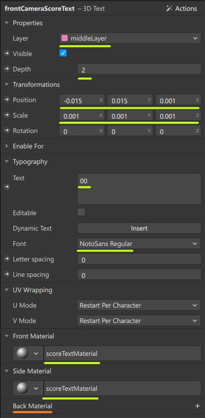
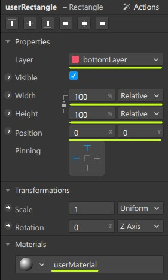
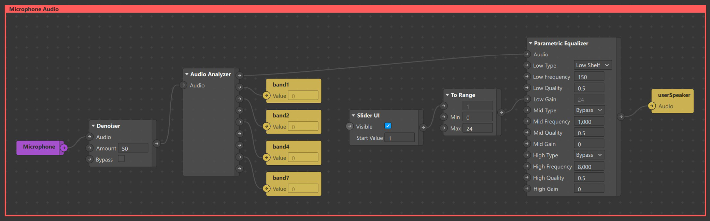
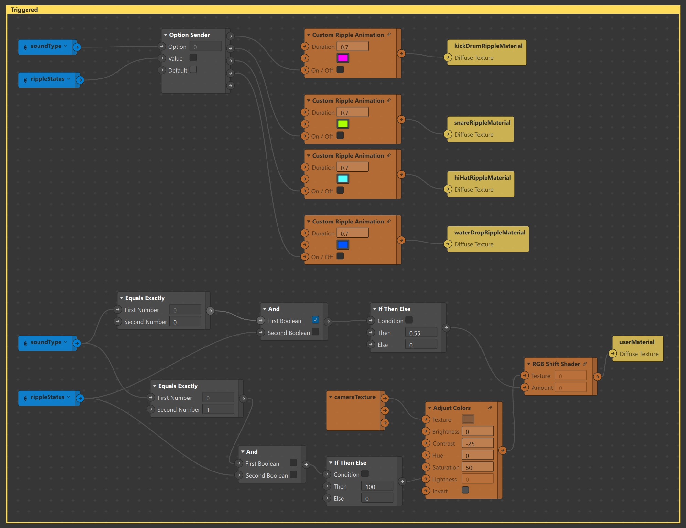
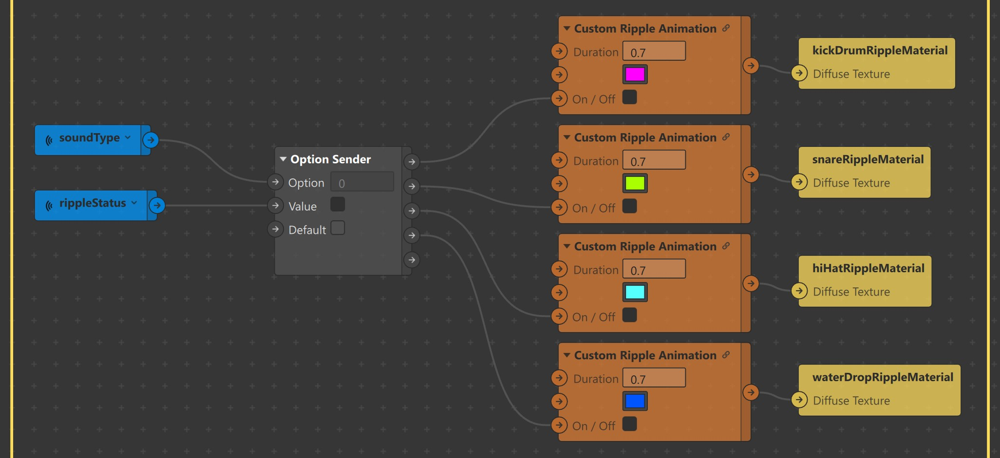

  
<p align="center">
  
</p>  

<p align="center">
  A Spark AR effect for  music lovers to learn, practise & perform beatboxing in a whole new way !
  <!-- <br>
  <br>
  <a href="https://github.com/twbs/bootstrap/issues/new?template=bug_report.md">Try it</a>
  ·
  <a href="https://github.com/twbs/bootstrap/issues/new?template=feature_request.md">Watch Demo</a>
  ·
  <a href="https://themes.getbootstrap.com/">Download</a>
  ·
  <a href="https://blog.getbootstrap.com/"></a>
</p> -->

## Overview
 
 
[](https://www.youtube.com/watch?v=YI7qU4-CAUk)

In this step-by-step tutorial, you will be creating a Spark AR effect which gamifies the whole beatboxing experience. Users score points & unlock new levels by beatboxing the right sounds. The effect enables beatboxers to showcase their skills like never before. You can see the effect in action using this link [Shockwave Demo Video](https://www.youtube.com/watch?v=vo5QYpSEzXg).

By the end of the tutorial, you will be familiar with using:

* **Audio Analyzer** patch and **Script** to split microphone audio into bands and differentiate sounds.

* **Shaders** patches to transform **Camera Texture** & **Materials** based on signals from **Audio Analyzer**.

* **Native UI Picker** items as levels to gamify the effect.

* **JSON** data to indicate sounds and create new levels for the effect.

* **Dynamic Instantiation** to recycle and reuse scene objects.

* **SDF Textures** to mimic **Spot Lights**.

The effect can recognize following sounds:

| # | Name |Equivalent Beatbox Sound  | Denoted By | 3D Object| Prominent Band | Color |
| --- | --- | --- | --- | ---| ---| --- |
| 1 | Kick Drum |[Listen](files/sounds/k.mp3) | **k**  | Cube | band1 |  `#ff55ff`|
| 2 | Snare |[Listen](files/sounds/s.mp3) | **s**  | Tetrahedron| band4|  `#aaff00`|
| 3 | Hi-Hat |[Listen](files/sounds/h.mp3) | **h**  | Cylinder | band7|  `#55ffff` |
| 4 | Water Drop (Beta)|[Listen](files/sounds/wd.mp3) | **wd**  | Droplet | band2 |  `#0055ff` |

## Table of contents
1. [Prerequisites](#1-prerequisites)
2. [Downloading the project](#2-downloading-the-project)
3. [Understanding the Assets](#3-understanding-the-assets)
    * [Patch Assets](#31-patch-assets)
    * [Blocks](#32-blocks)
    * [Textures](#33-textures)
    * [Audio & Playback Controllers](#34-audio--playback-controllers)
4. [Creating Layers & Scene Elements](#4-creating-layers--scene-elements)
	* [Layers](#41-layers)
	* [Score](#42-score)
	* [Grid Plane](#43-grid-plane)
	* [Circles](#44-circles)
	* [Lights](#45-lights)
	* [Confetti](#46-confetti)
	* [Speakers ](#47-speakers)
	* [Canvas](#48-canvas)
	* [Ripple Planes](#49-ripple-planes)
5. [Bridging Patch Editor & Script](#5-bridging-patch-editor--script)
	* [Creating Variables](#51-creating-variables)
	* [Analyzing Microphone Audio and Assigning Signals to Script Variables](#52-analyzing-microphone-audio-and-assigning-signals-to-script-variables)
6. [Scripting](#6-scripting)
	* [Importing Modules](#61-importing-modules)
	* [Importing Objects](#62-importing-objects)
	* [Native UI Picker & PersistenceModule](#63-native-ui-picker--persistencemodule)
	* [Progress Bar & Confetti](#64-progress-bar--confetti)
	* [Animation Driver](#65-animation-drivers)
	* [Animating Blocks based on Level Data](#66-animating-blocks-based-on-level-data)
	* [Monitor Signal Power, Differentiate Sounds and Identify Hits](#67-monitoring-signal-power-differentiate-sounds-and-identify-hits)
7. [Patch Editor](#7-patch-editor)
	* [Signal Senders](#71-signal-senders)
	* [Level Music](#72-level-music)
	* [Level Introduction](#73-level-introduction)
	* [Triggered UI](#74-triggered-ui)
8. [Next Steps](#8-next-steps)

## 1. Prerequisites

Following is an Advanced tutorial for Spark AR Creators who have some experience in building complex effects. Please familiarize yourself with the following concepts before proceeding.

- [Blocks](https://sparkar.facebook.com/ar-studio/learn/patch-editor/blocks/introduction-to-blocks)

- [Audio Playback Controller](https://sparkar.facebook.com/ar-studio/learn/tutorials/audio-basics)

- [Energy Meter and Audio Analyzer Patches](https://sparkar.facebook.com/ar-studio/learn/tutorials/energy-meter-audio-analyzer)

- [Lights](https://sparkar.facebook.com/ar-studio/learn/tutorials/positioning-lights)

- [Native UI Slider](https://sparkar.facebook.com/ar-studio/learn/tutorials/native-ui-slider)

- [Particle Systems](https://sparkar.facebook.com/ar-studio/learn/tutorials/adding-particle-systems)

- [Scripting](https://sparkar.facebook.com/ar-studio/learn/tutorials/scripting)
    - [Script to Patch Bridging](https://sparkar.facebook.com/ar-studio/learn/patch-editor/bridging)

    - [Dynamic Instantiation](https://sparkar.facebook.com/ar-studio/learn/scripting/dynamic-instantiation)
    
    - [Native UI Picker](https://sparkar.facebook.com/ar-studio/learn/tutorials/native-ui-picker#scripting)

    - [AudioModule](https://sparkar.facebook.com/ar-studio/learn/reference/classes/audiomodule)

    - [AnimationModule](https://sparkar.facebook.com/ar-studio/learn/reference/classes/animationmodule)

    - [CameraInfoModule](https://sparkar.facebook.com/ar-studio/learn/reference/classes/camerainfomodule)

    - [PersistenceModule](https://sparkar.facebook.com/ar-studio/learn/reference/classes/persistencemodule)

    - [TimeModule](https://sparkar.facebook.com/ar-studio/learn/reference/classes/timemodule)

## 2. Downloading the project

To follow this tutorial, [download sample content](sample/sample_content.zip) and open the unfinished effect in [Spark AR Studio v102 and above.](https://sparkar.facebook.com/ar-studio/download/) All the required assets have already been imported to help you get started.

## 3. Understanding the Assets


### 3.1 Patch Assets

All patch assets other than **Circle** & **Custom Ripple Animation**, have been imported from Spark AR Library.

| # |  Name | Patch Image  | Sample Output |
|--- | --- | --- | --- |
| 1 | **4 Colors Gradient** |   |  |
| 2 | **Circle** |   |  |
| 3 | **Adjust Colors**|  |   |
| 4 | **Custom Ripple Animation**|    | |
| 5| **Grid**|  |  |
| 6| **RGB Shift Shader**|    |   |
 

### 3.2 Blocks

The effect uses the following 4 **Blocks** each representing a particular sound.

| # | Name | Sound | Image |
| --- | --- |--- | --- |
|1|**cubeBlock**|Kick Drum|   | 
|2|**cylinderBlock**|Snare|   | 
|3|**tetrahedronBlock**|Hi-Hat|   | 
|4|**waterDropBlock**|Water Drop (Beta)|   | 

All block send & receive the following inputs & output respectively.

#### Input

* **z-position** (Number) : Blocks use this to animate 3D object along z-axis.
* **hit** (Boolean) : Used to trigger hit animation, change materials & visibility of items.

#### Output

* **z-position** (Number) : To determine the current position of the 3D object in the z-axis at any given instance.

### 3.3 Textures

| Textures | Usage |
| --- | --- |
|    | **[lock](files/screenshots/lock.png)** is used in Native UI picker to denote levels which are yet to be unlocked by the user. ||
|    | **l1** to **l7** are used as items in Native UI picker to denote levels unlocked by the user. |
|   | **cameraTexture**  is transformed using **Shaders** patches based on audio signals. |
|    | **[dot](files/screenshots/dot.jpg)** is used by **scoreBackgroundMaterial** to create circular background. |
|    | **[hit](files/screenshots/hit.png)** is used by **Plane** objects to indicate that a **Block** was hit.|

### 3.4 Audio & Playback Controllers

Audio files are categorised into:
- **Instruction Audio**: Used to guide users.([level1Intro.m4a](files/sounds/level1Intro.m4a),[level2Intro.m4a](files/sounds/level2Intro.m4a),[level3Intro.m4a](files/sounds/level3Intro.m4a),[level6Intro.m4a](files/sounds/level6Intro.m4a))
- **Level Audio**: Background music played for each level.([level1Music.m4a](files/sounds/level1Music.m4a),[level2Music.m4a](files/sounds/level2Music),[level4Music.m4a](files/sounds/level4Music.m4a),[level5Music.m4a](files/sounds/level5Music.m4a),[level6Music.m4a](files/sounds/level6Music.m4a),[level7Music.m4a](files/sounds/level7Music.m4a)), 
- **Level Unlock Audio**: Played when user unlocks a level. [levelUnlocked.m4a](files/sounds/levelUnlocked.m4a)


**unlockAudioPlaybackController** is used to play [levelUnlocked.m4a](files/sounds/levelUnlocked.m4a) from script.


## 4. Creating Layers & Scene Elements
 
### 4.1 Layers

A total of three layers are used to render objects in the scene.


  
Go to **Layers** panel, create three layers and rename them to **topLayer**, **middleLayer** & **bottomLayer**. Make sure layers are arranged in the same order as shown in the image.

### 4.2 Score


#### Front Camera

1. In the **Scene** panel, create a new **Face Tracker** object, call it **faceTracker**.

2. Right-click on the **faceTracker** object > **Add** > Choose **Null  Object** from the list and call it **scoreContainer**.

3. Right-click on the **scoreContainer** object > **Add** > Choose **Plane** from the list and call it **scoreBackgroundPlane**.

3. Update properties of **scoreBackgroundPlane** to:

    
    

4. In the **Scene** panel, Right-click on the **scoreBackgroundPlane** object > **Add** > Choose **3D Text** from the list and call it **frontCameraScoreText**.

5. Update properties of **frontCameraScoreText** to:

    

6. Select the **faceTracker** object and change its **Layer** to **middleLayer** in the Inspector. Proceed by selecting **Add Object and Children**. At this point, your project will look like this: 
    
    

The Score is currently positioned at the center of the screen. Using patches, it will be made to float on top of user's head. But before that, let's understand how  patches are organised in the project.

You will notice 6 **Comment Patches** of different color in the Patch Editor.
They are patches are used to organize patches into different categories.


| # | Name | Color  | Content | 
| --- | --- | --- | --- | 
| 1 | **Signal Senders** | Blue |  All **Sender** patches,**Variables From Script** patchSignal Senders and **Camera** patch |
| 2 | **Level Music** | Orange | Patches required to play **Level Audio**  |
| 3 | **Level Introduction** | Purple | Patches required to play **Instruction Audio**  |
| 4 | **Microphone Audio** | Red | Patches required to split microphone audio into bands and boost frequencies  |
| 5 | **Triggered** | Yellow | Patches required to transform **Camera Texture** & **Materials** based on **Microphone Audio** |
| 6 | **Normal** | Green | Patches required to position and transform **Scene** elements  |


Make sure all the patches created in this section are placed inside the green **Normal Comment Patch** unless specified otherwise.

Now let's make the Score float on top of user's head.
 
1. Select **scoreContainer**, go to Inspector and click on **Actions**. 

    

2. From the dropdown, select **Animate** > **Float**. This will open up the Patch Editor and automatically create patches required to make the **scoreContainer** float. 

4. Edit values of **Transition** Patch to reduce the range of motion of **scoreContainer**. 

    


#### Back Camera
1. In the **Scene** panel, create a new **Plane Tracker** object, call it **planeTracker**.

2. As of now, the class name required to dynamically instantiate **3D Text** is not known so we will duplicate it. Right-click on the **scoreContainer** object & select **Duplicate** from the list. This will create **scoreContainer0**.

3. Drag & Drop **scoreContainer0** into **planeTracker** and rename it to **scoreContainer**. Select **frontCameraScoreText** and rename it to **backCameraScoreText**.  

    

4. Update **scoreContainer** properties to :

    


5. Feel free to position **scoreBackgroundPlane** anywhere in the world space.

### 4.3 Grid Plane


 The flat horizontal surface on which objects slide is called Grid Plane.

1. Under **Focal Distance**, create a new **Null Object** object and call it **frontCameraPlatform**.

2. Update properties of **frontCameraPlatform** to:
    
    

3. Duplicate **frontCameraPlatform** object, Drag & Drop it into **planeTracker** and rename it to **backCameraPlatform**.

Using Script we will, 
1. Dynamically instantiate **gridPlane** object & import **gridMaterial**
2. Update properties & material of **gridPlane**.
3. Import **frontCameraPlatform** & **backCameraPlatform** as **Scene Objects**.
4. Make **gridPlane** a child of **frontCameraPlatform** or **backCameraPlatform**.

Add **Scripting Dynamic Instantiation** capability to your project & switch to code editor.

```javascript
const Scene = require('Scene'); // To import Scene Elements 
const Materials = require('Materials'); // To import Materials  
const CameraInfo = require('CameraInfo'); // To determine whether the user is using front/back camera

(async function () {
 
    //==============================================================================
    // Dynamically Instantiating Objects + Importing corresponding Materials & Scene objects.
    //==============================================================================

    const [gridPlane, cameraPlatformItems, gridMaterial, frontCameraPlatform, backCameraPlatform, frontCameraScoreText, backCameraScoreText] = await Promise.all([
        
        Scene.create("Plane", {
            "name": "gridPlane",
        }),

        //cameraPlatformItems will be used to group all the dynamically instantiated object.
        Scene.create("SceneObject", {
            "name": "cameraPlatformItems",
        }),

        Materials.findFirst("gridMaterial"),

        Scene.root.findFirst('frontCameraPlatform'),
        Scene.root.findFirst('backCameraPlatform'),

        Scene.root.findFirst('frontCameraScoreText'),
        Scene.root.findFirst('backCameraScoreText'),

    ]);

    //To determine whether the user is using front/back camera at any given point.
    var frontCamera = false;

    //Stores the status of Dynamic Instantiation of objects.
    var instantiated = false;

    //scoreText will hold reference to frontCameraScoreText/backCameraScoreText
    var scoreText = frontCameraScoreText;

    //==============================================================================
    // Monitor whether the user is using front/back camera
    //==============================================================================

    CameraInfo.captureDevicePosition.monitor({ fireOnInitialValue: true }).subscribe(function (event) {

        //Set value of frontCamera
        (event.newValue == "FRONT") ? frontCamera = true : frontCamera = false;

        //Remove cameraPlatformItems from it's previous parent(frontCameraPlatform/backCameraPlatform)
        instantiated?cameraPlatformItems.removeFromParent():"";

        //Update reference stored in scoreText based on the value of frontCamera
        frontCamera ? scoreText = frontCameraScoreText : scoreText = backCameraScoreText ;

        //Add cameraPlatformItems as child of frontCameraPlatform / backCameraPlatform based on the value of frontCamera
        frontCamera ? frontCameraPlatform.addChild(cameraPlatformItems) : backCameraPlatform.addChild(cameraPlatformItems)
        
        // (Optional) Update properties of gridPlane based on the value of frontCamera.
        frontCamera ? gridPlane.transform.y = 0.1 : gridPlane.transform.y = 0.5;
        frontCamera ? gridPlane.transform.scaleX = 12 : gridPlane.transform.scaleX = 6;
        frontCamera ? gridPlane.transform.scaleY = 24 : gridPlane.transform.scaleY = 16;
        
        //Check if the objects were not instantiated before
        if (!instantiated) {

            //set instantiated to true so that we don't have to instantiate again.
            instantiated = true;

            //Set properties & material of gridPlane
            gridPlane.transform.z = -0.22;
            gridPlane.transform.scaleZ = 1;
            gridPlane.material = gridMaterial;

            //Add all the instantiated objects as a children of cameraPlatformItems
            cameraPlatformItems.addChild(gridPlane);

            
        }

    });

})();

```

 At this point, your project will look like this:


Let's generate grid pattern, animate and assign it as texture to **gridMaterial**.
 
1. Locate the **Grid** patch  in the **Assets** panel. Drag and Drop it inside the Patch Editor.

    

2. Edit values of **Grid** patch,  Set
      * **Color A** to **#000000**
      * **Color B** to **#000000**, also set value of **Alpha Channel** to **0**
      * **Size X** & **Size Y** to **12**
      * **Shift X** to **0.3**
      * **Rotation** to **45**

4. Connect **Grid** patch output to **Diffuse Texture** of **gridMaterial** patch. Grid pattern will now be visible on simulator.

5. Create a **Loop Animation** patch and a **Transition** patch to animate Grid pattern. 

6. Set **End** value of **Transition** patch to **1.4**

7. Reduce **Duration** of **Loop Animation** patch to **0.6**.

8. Connect 
    * **Progress** output of **Loop Animation** patch to **Progress** input of **Transition** patch.
    * Output of **Transition** patch to **Shift Y** port of **Grid** patch.

9. Next, we need logic to enable/disable Grid Animation, as and when user starts/stops recording video.

    

10. In the **Scene** panel, select **Camera** object, drag and drop it inside the Patch Editor to create **Camera** patch. Make sure it is placed inside the blue **Signal Senders Comment** patch.

11. Create a new **Sender** patch and call it  **videoRecording**. Connect **Video Recording** output of **Camera** patch to input of **videoRecording** **Sender** patch.

12. Use a **Receiver** patch to receive **videoRecording** signal and connect it to  **Enable** input port of  **Loop Animation** patch.

    

13. Use a **Delay** patch to enable Grid Animation after a delay **0.8** seconds from the time user starts recording video.
 

 
### 4.4  Circles

**Circles** indicate special locations on the **gridPlane**. When a 3D object  passes over any of these locations, user has to perform the corressponding beatboxing sound to hit the object and score a point.


We will follow the same procedure discussed in the previous step to instantiate  **kickDrumHitCircle**, **hiHatHitCircle** & **snareHitCircle** and add them as children of **frontCameraPlatform**/ **backCameraPlatform**.

```javascript
/* ... Truncated Imported Modules */

(async function () {
 
    //=========================================================================================
    // Dynamically Instantiating Objects + Importing corresponding Materials & Scene objects.
    //=========================================================================================

    const [gridPlane, kickDrumHitCircle, hiHatHitCircle, snareHitCircle, cameraPlatformItems, gridMaterial, circleMaterial, frontCameraPlatform, backCameraPlatform, frontCameraScoreText, backCameraScoreText] = await Promise.all([
        
        /* ... Truncated Code */

         Scene.create("Plane", {
            "name": "kickDrumHitCircle",
        }),

        Scene.create("Plane", {
            "name": "hiHatHitCircle",
        }),

        Scene.create("Plane", {
            "name": "snareHitCircle",
        }),

        /* ... Truncated Code */

        Materials.findFirst("circleMaterial"),

        /* ... Truncated Code */

    ]);

    /* ... Truncated Code */

    //==============================================================================
    // Monitor whether the user is using front/back camera
    //==============================================================================

    CameraInfo.captureDevicePosition.monitor({ fireOnInitialValue: true }).subscribe(function (event) {

        /* ... Truncated Code */
        
        //Check if the objects were not instantiated before
        if (!instantiated) {

            /* ... Truncated Code */

            //Set properties & material of kickDrumHitCircle, hiHatHitCircle, snareHitCircle
            kickDrumHitCircle.transform.y = -0.2;
            kickDrumHitCircle.transform.z = -0.21;
            kickDrumHitCircle.transform.scaleX = 1.8;
            kickDrumHitCircle.transform.scaleY = 1.8;
            kickDrumHitCircle.transform.scaleZ = 1.8;
            kickDrumHitCircle.material = circleMaterial;

            hiHatHitCircle.transform.x = -0.1;
            hiHatHitCircle.transform.y = -0.2;
            hiHatHitCircle.transform.z = -0.21;
            hiHatHitCircle.transform.scaleX = 1.8;
            hiHatHitCircle.transform.scaleY = 1.8;
            hiHatHitCircle.transform.scaleZ = 1.8;
            hiHatHitCircle.material = circleMaterial;

            snareHitCircle.transform.x = 0.1;
            snareHitCircle.transform.y = -0.2;
            snareHitCircle.transform.z = -0.21;
            snareHitCircle.transform.scaleX = 1.8;
            snareHitCircle.transform.scaleY = 1.8;
            snareHitCircle.transform.scaleZ = 1.8;
            snareHitCircle.material = circleMaterial;

            //Add all the instantiated objects as a children of cameraPlatformItems
             
             /* ... Truncated Code */

            cameraPlatformItems.addChild(kickDrumHitCircle);
            cameraPlatformItems.addChild(hiHatHitCircle);
            cameraPlatformItems.addChild(snareHitCircle);

        }

    });

})();

```
 At this point, your project will look like this:


Next, generate circle texture and assign it to **circleMaterial**.
 
1. Locate **Circle** patch  in the **Assets** panel. Drag and Drop it inside the Patch Editor.

    

3. Connect output of **Circle** patch to the **Diffuse Texture** port of **circleMaterial** patch. Circle pattern will now be visible in the simulator.

3. Animate circles to rotate in **Y** axis as soon as the user starts recording video. For this, use **videoRecording** Receiver patch from the previous section. Connect the output of **videoRecording** Receiver patch to the **rotation** input port of **Circle** patch.
    

### 4.5 Lights


The effect uses,
1. **Point Light** 
2. **Directional Light** 
3. **SDF Textures** to mimic **3 Spot Lights**.

Let's begin by adding **Point Light** & **Directional Light** to the scene.

1. In the **Scene** panel, create a new **Point Light** object and call it **pointLight**.

2. Update properties of **pointLight** to:

     

3. Create a new **Directional Light** object and call it **directionalLight**.

4. Update properties of **directionalLight** to

      

5. Select  **pointLight**, **directionalLight** and change its **Layer** to **middleLayer** in the Inspector    

We want the **circles** present on the **gridPlane** to glow. To acheive this, we will use **Plane** objects with **SDF Textures** applied to them.

We will instantiate three **Plane** objects called **kickDrumHitCircleGlow**, **hiHatHitCircleGlowMaterial** & **snareHitCircleGlowMaterial** and add them as children of **frontCameraPlatform**/ **backCameraPlatform**.

```javascript
/* ... Truncated Imported Modules */

(async function () {
 
    //=========================================================================================
    // Dynamically Instantiating Objects + Importing corresponding Materials & Scene objects.
    //=========================================================================================

    const [gridPlane, kickDrumHitCircle, hiHatHitCircle, snareHitCircle, kickDrumHitCircleGlow, hiHatHitCircleGlow, snareHitCircleGlow, cameraPlatformItems, gridMaterial, circleMaterial, hiHatHitCircleGlowMaterial, snareHitCircleGlowMaterial, kickDrumCircleGlowMaterial, frontCameraPlatform, backCameraPlatform, frontCameraScoreText, backCameraScoreText ] = await Promise.all([
        
        /* ... Truncated Code */

        Scene.create("Plane", {
            "name": "kickDrumHitCircleGlow",
        }),

        Scene.create("Plane", {
            "name": "hiHatHitCircleGlow",
        }),

        Scene.create("Plane", {
            "name": "snareHitCircleGlow",

        }),

        /* ... Truncated Code */

        Materials.findFirst("hiHatHitCircleGlowMaterial"),
        Materials.findFirst("snareHitCircleGlowMaterial"),
        Materials.findFirst("kickDrumCircleGlowMaterial"),

        /* ... Truncated Code */

    ]);

    /* ... Truncated Code */

    //==============================================================================
    // Monitor whether the user is using front/back camera
    //==============================================================================

    CameraInfo.captureDevicePosition.monitor({ fireOnInitialValue: true }).subscribe(function (event) {

        /* ... Truncated Code */
        
        //Check if the objects were not instantiated before
        if (!instantiated) {

            /* ... Truncated Code */

            //Set properties & material of kickDrumHitCircleGlow, hiHatHitCircleGlow, snareHitCircleGlow
            kickDrumHitCircleGlow.transform.x = 0;
            kickDrumHitCircleGlow.transform.y = -0.2;
            kickDrumHitCircleGlow.transform.z = -0.21;
            kickDrumHitCircleGlow.transform.scaleX = 2;
            kickDrumHitCircleGlow.transform.scaleY = 2;
            kickDrumHitCircleGlow.transform.scaleZ = 2;
            kickDrumHitCircleGlow.material = kickDrumCircleGlowMaterial;

            hiHatHitCircleGlow.transform.x = -0.09;
            hiHatHitCircleGlow.transform.y = -0.2;
            hiHatHitCircleGlow.transform.z = -0.21;
            hiHatHitCircleGlow.transform.scaleX = 2;
            hiHatHitCircleGlow.transform.scaleY = 2;
            hiHatHitCircleGlow.transform.scaleZ = 2;
            hiHatHitCircleGlow.material = hiHatHitCircleGlowMaterial;

            snareHitCircleGlow.transform.x = 0.09;
            snareHitCircleGlow.transform.y = -0.2;
            snareHitCircleGlow.transform.z = -0.21;
            snareHitCircleGlow.transform.scaleX = 2;
            snareHitCircleGlow.transform.scaleY = 2;
            snareHitCircleGlow.transform.scaleZ = 2;
            snareHitCircleGlow.material = snareHitCircleGlowMaterial;

            //Add all the instantiated objects as a children of cameraPlatformItems
             
             /* ... Truncated Code */

            cameraPlatformItems.addChild(kickDrumHitCircleGlow);
            cameraPlatformItems.addChild(hiHatHitCircleGlow);
            cameraPlatformItems.addChild(snareHitCircleGlow);
            
        }

    });

})();

```
At this point, your project will look like this:

    

Next, let's generate **SDF Textures**.

1. Create a **SDF Circle** patch & **Smooth Step** patch.

2. Update properties of **Smooth Step** patch. Set,
    * **Edge Min** to **0.4**
    * **Edge Max** to **0**

     

3. Connect,
    * Output of **SDF Circle** patch to first port of **Smooth Step** patch.
    * Output of **Smooth Step** patch to Diffuse Texture of **kickDrumCircleGlowMaterial**, **hiHatHitCircleGlowMaterial**, **snareHitCircleGlowMaterial**.

4. Create a **Loop Animation** patch and a **Transition** patch to animate **Radius** of **SDF Circle**

5. Edit values of **Transition** patch
  
    

6. Connect 
    * **Progress** output of **Loop Animation** patch to  **Progress** input of **Transition** patch.
    * Output port of **Transition** patch to **Radius** port of **SDF Circle** patch.

At this point, your project will look like this:

    

### 4.6 Confetti


The effect uses two **Particle Systems** to create Confetti. They are triggered from script as soon as the user unlocks a level.

1. Create two new **Particle Systems** objects and rename them to **confettiYellow** and  **confettiGreen**.

2. In the Inspector, Set **confettiYellowMaterial** and **confettiGreenMaterial** as materials for **confettiYellow** and **confettiGreen** respectively.

3. There are several ways of configuring the **Particle Systems**. You can proceed with the values provided below or experiment with your own values.

    

3. Once you are satisfied with the configuration of **Particle Systems**, set **Birthrate** to **0** so that it can be triggered from script as soon as user unlocks a level.

### 4.7 Speakers 

The effect uses 4 **Speaker** objects.

| # | Name | Usage | Source \| Controlled by  |
| --- | --- | --- | --- |
| 1 | userSpeaker | Playing Microphone audio| Patches |
| 2 | unlockSpeaker | Playing Level Unlock audio| unlockAudioPlaybackController through Script |
| 3 | levelMusicSpeaker | Playing Level audio | Patches |
| 4 | levelIntroSpeaker | Playing Instruction audio | Patches |


1. In the **Scene** panel, create a new **Null Object** object & call it **speakers**.

2. Right-click on **speakers** object > **Add** > Choose **Speaker** from the list. Repeat this step until you have 4 **Speaker** objects in total.

3. Rename **Speaker** objects to **userSpeaker**, **unlockSpeaker**, **levelMusicSpeaker** & **levelIntroSpeaker**.

4. With the **unlockSpeaker** selected, In the Inspector, change the **Audio** source to **unlockAudioPlaybackController**.

5. **Audio** source for the remaining **speakers** will be provided using patches in the next section.
 
### 4.8 Canvas

 
1. In the **Scene** panel, create a new **Canvas** object & call it **canvas**.

2. Select **canvas** object and change its **Layer** to **middleLayer** in the Inspector.

3. Right-click on **canvas** object > **Add** > Choose **Rectangle** from the list. Repeat this step once again. 
 
4. Rename **Rectangle** objects to **progressBarRectangle** & **userRectangle**.

5. Update properties of **progressBarRectangle** to:

    
    

6. Uncheck the **Visible** property of **progressBarRectangle** so that it can be controlled from script.

7. Update properties of **userRectangle** to:

    


At this point, you may not notice any difference in the effect with or without the **userRectangle**. This is because, **cameraTexture** has been assigned as **Texture** of **userMaterial**. Using patches, we will be performing color manipulations to **cameraTexture** in the next section.

### 4.9 Ripple Planes


Ripple Planes consists of three **Plane** objects called **kickDrumRipplePlane**, **snareRipplePlane** & **hiHatRipplePlane**.

1. In the **Scene** panel, create a new **Null Object** object & call it **ripplePlanes**.

2. Right-click on **ripplePlanes** object > **Add** > Choose **Plane** from the list. Repeat this step thrice. 

3. Rename **Rectangle** objects to **kickDrumRipplePlane**, **snareRipplePlane**, **hiHatRipplePlane** & **waterDropRippleMaterial** .

4. Update properties of **kickDrumRipplePlane**, **snareRipplePlane**, **hiHatRipplePlane** & **waterDropRippleMaterial** to:

    
    
    

5. In the Inspector, Set **kickDrumRippleMaterial**, **snareRippleMaterial** and **hiHatRippleMaterial** as materials for **kickDrumRipplePlane**, **snareRipplePlane** & **hiHatRipplePlane** respectively. We will be assigning **Textures** to these material in the next section. At this point, your project will look like this: 

    
  
## 5. Bridging Patch Editor & Script 

### 5.1 Creating Variables

**Variables to Script :**

We will be passing two types of variables from Patch Editor to Script.

* **recording** is a **Boolean** variable that indicates whether the user has started recording video or not.

* **band1**, **band2**, **band4**, **band7**  are a **Number** variables used to determine the Signal Power of **Kick Drum**, **Snare** & **Hi-Hat** present in **Microphone Audio**. Signals will be assigned to these variables in the next section.

Select **Script** file in the **Assets Panel** and create the following variables in the **Inspector Panel**.


**Variables from Script :**

Following variables received from **Script**.


| # | Name | Type  | Purpose |
| --- | --- | --- | --- | 
| 1 | **currentLevel**  | **Number** | Indicates the current level the user has selected from the **Native UI Picker** |
| 2 | **soundType**  | **Number**  |  Indicates the type of sound (KICK: 0, SNARE: 1, HIHAT: 2) detected in the **Microphone Audio**  |
| 3 |  **rippleStatus**  | **Boolean** |  Used to enable/disable **Custom Ripple Animation** patch. Value becomes true whenever a sound (KICK, SNARE, HIHAT) detected in the **Microphone Audio** exceeds the threshold value  |
| 4 | **playIntroChange**  | **Boolean** |  Negated whenever the user selects a different level using the **Native UI Picker**. This variable will be used to trigeer the controller that plays **Level Audio Instruction**  |
| 5 | **levelPlayable**  | **Boolean** | Indicates whether the user has unlocked the level that is currently selected on the **Native UI Picker**  | 
 
Select **Script** file in the **Assets Panel** and create the following variables in the **Inspector Panel**.


### 5.2 Analyzing Microphone Audio and Assigning Signals to Script Variables


1. From the **Scene** Panel, drag and drop the **Microphone** object into the Patch Editor and place it inside the red **Microphone Audio** Comment Patch.

2. Use a **Denoiser** patch to reduce background noise. Set the **Amount** value to **50**.

    

3. Next, connect output of **Denoiser** to a **Audio Analyzer** patch. Obtain Signal Power of **Band 1**, **Band 2**, **Band 4** & **Band 7** and pass them as **Variables To  Script**.

4. Connect **Audio** output from **Audio Analyzer** patch to **Audio** input of **Parametric Equailizer** patch. 

5. Set values of **Parametric Equailizer** patch to the following. This will boost bass frequencies of the **Microphone** audio without altering the treble frequencies.

    

6. Add **Slider UI** patch and a **To Range** patch to control the amount of **Low Gain** between **0** to **24**. This will allow user to decide the amount of bass boost from the **Native UI slider**

7. Connect output of **Parametric Equailizer** to **Audio** input of **userSpeaker** patch.

## 6. Scripting

Add the following capabilities to your project.
* **Native UI Picker** under **Native UI Control**.

* **Persistence** (Add **data** to **Whitelisted keys**).
 
 
### 6.1 Importing Modules
 
```javascript
// Import all the required modules.

const Time = require('Time'); // To keep track of Time and trigger animations accordingly
const Audio = require('Audio'); // To play Level Unlock Audio
const Scene = require('Scene'); // To import Scene Elements 
const Blocks = require('Blocks'); // To instantiate blocks
const Patches = require('Patches'); // To exchange data between to Patch Editor and Script
const NativeUI = require('NativeUI'); // To create Native UI Picker
const Textures = require('Textures'); //  To import textures required by Native UI Picker 
const Animation = require('Animation'); // To Animate cubes, cylinders & tetrahedrons
const Materials = require('Materials'); // To import Materials 
const Persistence = require('Persistence'); // To store max level unlocked by the user
const Diagnostics = require('Diagnostics'); // To debug code
const CameraInfo = require('CameraInfo'); // To determine whether the user is using front/back camera

(async function () {

/* ... Truncated Dynamically Instantiating Objects + Importing corresponding Materials & Scene objects. */

/* ... Truncated CameraInfo Monitoring Code */

})();

```
**Level JSON**

**Level JSON** is used to configure each level. It's structure is as follows.
* **level_X** indicates the level number or (index+1) of item selected in Native UI picker. Ex:```"level_1"```
    * **duration** of the entire level indicated in milli seconds. Ex:```"duration": 38000```
    * **minscoreText** indicates the min score user requires to unlock next level. Ex:```"minscoreText": 25```
    * **Time** & **Sound Letter** indicates the instance in time at which the animation of a **Block** corresponding to the specified **Sound Letter** should start. Ex:```"1.0": ["k"]```

```javascript
{
    "level_1": 
    {
        "duration": 38000,
        "minscoreText": 25,
        "1.0": ["k"],
        "2.0": ["k"],
        "3.5": ["h"],
        "5.0": ["k"]
    },
    "level_2": 
    {
        "duration": 29000,
        "minscoreText": 22,
        "1.0": ["k"],
        "1.7": ["k"],
        "2.0": ["s"],
        "3.0": ["k"],
        "3.7": ["k"],
        "4.0": ["s"],
        "5.0": ["k"]
    }
}        
```

JSON data can be stored in the same **script.js** file or externally in  different .js file which can be imported into **script.js** using ```const levelJson = require("./filename");``` 

To add a new level, modify **Level JSON** and configuration of **Native UI Picker**. 


Before proceeding to the next step, let's create containers to hold the Models(Blocks).

1. In the **Scene** panel, create a new **Null Object** object & call it **frontCameraModelContainer**.

    

2. Repeat the previous step and create a **Null Object** object under **Plane Tracker** and call it **backCameraModelContainer**

3. Select both **frontCameraModelContainer** & **backCameraModelContainer** and change their **Layer** to **middleLayer** in the Inspector.


### 6.2 Importing Objects

Use **Promise** inside the **Asynchronous** function to import all the required **Scene objects**, **Textures**, **AudioPlaybackController**, **Materials** and **Variables** passed from Patch Editor. Assign them to array of variables.

```javascript
/* ... Truncated Imported Modules */

(async function () {

    /* ... Truncated Dynamically Instantiating Objects + Importing corresponding Materials & Scene objects. */

    //===============================================================================================================================
    // Import all the required Scene objects, Textures, AudioPlaybackController and Variables passed from Patch Editor
    //===============================================================================================================================
   
    const [band1, band2, band4, band7, frontCameraModelContainer, backCameraModelContainer, l1, l2, l3, l4, l5, l6, l7, lockTexture, recording, progressBarRectangle, confettiYellow, confettiGreen, unlockAudioPlaybackController] = await Promise.all([
        Patches.outputs.getScalar("band1"),
        Patches.outputs.getScalar("band2"),
        Patches.outputs.getScalar("band4"),
        Patches.outputs.getScalar("band7"),
        Scene.root.findFirst('frontCameraModelContainer'),
        Scene.root.findFirst('backCameraModelContainer'),
        Textures.findFirst('l1'),
        Textures.findFirst('l2'),
        Textures.findFirst('l3'),
        Textures.findFirst('l4'),
        Textures.findFirst('l5'),
        Textures.findFirst('l6'),
        Textures.findFirst('l7'),       
        Textures.findFirst('lockTexture'),
        Patches.outputs.getBoolean("recording"),
        Scene.root.findFirst('progressBarRectangle'),
        Scene.root.findFirst('confettiYellow'),
        Scene.root.findFirst('confettiGreen'),
        Audio.getAudioPlaybackController('unlockAudioPlaybackController'),
    ]);

    /* ... Truncated CameraInfo Monitoring Code */

})();    
```
### 6.3 Native UI Picker & PersistenceModule

In this section, you will:
* Set up the configuration for **Native UI Picker**.

* Assign textures to items of picker based on level data from **PersistenceModule**.
* Subscribe to **selectedIndex** property of the picker.
* Pass values from Script to Patch Editor.

```javascript
/* ... Truncated Imported Modules */

(async function () {

    /* ... Truncated Promises */

    //==============================================================================
    // Native UI Picker variables
    //==============================================================================

    // Store reference to Native UI Picker
    const picker = NativeUI.picker; 

    // Initialize to Level 1
    let currentSelectedIndex = 0; 
    
    let configuration = {
        selectedIndex: 0,
        items: [
            { image_texture: l1 },
            { image_texture: lockTexture },
            { image_texture: lockTexture },
            { image_texture: lockTexture },
            { image_texture: lockTexture },
            { image_texture: lockTexture },
            { image_texture: lockTexture },
        ]
    };

    // Icons of all levels assigned to an array 
    let levelIcons = [l1, l2, l3, l4, l5, l6, l7];
    
    // Negated whenever user selects a new item from Native UI picker
    var playIntroChange = false;

    //==============================================================================
    // Persistence variables
    //==============================================================================

    // Store a reference to the userScope
    const userScope = Persistence.userScope; 
    
    // JavaScript object to store the data
    const data = { level: 0 }; 
    
    // Max level unlocked by the user
    var maxLevelUnlocked = 0; 

    //==============================================================================
    // Fetch Max Unlocked Level from stored data
    //==============================================================================
  
    try {
        
        // Attempt to get the stored data and if successful
        const result = await userScope.get('data');
        
        // Assign the obtained level data to maxLevelUnlocked
        maxLevelUnlocked = parseInt(result.level.toString());   
       
        // Loop through all the items of Native UI picker and assign respective levelIcons as textures to unlocked levels
        for (let index = 0; index <= result.level; index++) {
            configuration.items[index] = { image_texture: levelIcons[index] };
        }

    } catch (error) {

        // If not successful, then the value of maxLevelUnlocked is its default value which is 0.
        Diagnostics.log('Failed to retrieve data, ' + error);
    }

    // Configure Native UI Picker and display it
    picker.visible = true;
    picker.configure(configuration);
 
    //==============================================================================
    // Monitor changes to selectedIndex of picker
    //==============================================================================
   
    picker.selectedIndex.monitor().subscribe(function (selectedIndex) {
        
        // Value of playIntroChange is negated and sent to the Patch Editor
        playIntroChange = !playIntroChange;
        Patches.inputs.setBoolean("playIntroChange",playIntroChange);

        //Index of newly selected item is assigned
        currentSelectedIndex = selectedIndex.newValue;
 
        // Value of levelPlayable is determined based on the levels unlocked by the user and sent to the Patch Editor
        Patches.inputs.setBoolean("levelPlayable",currentSelectedIndex <= maxLevelUnlocked?true:false);
    });

    //Changes to index of newly selected item is sent to the Patch Editor
    Patches.inputs.setScalar("currentLevel", picker.selectedIndex);

    /* ... Truncated CameraInfo Monitoring Code */

})();    
```

At this point, your project will look like this: 

 


### 6.4 Progress Bar & Confetti

In this section, you will:
* Set up **Animation Driver** variables of **Progress Bar**.

* Monitor whether the user has started recording video and based on this
    
    * Reset **Confetti**, **Score** & **unlockAudioPlaybackController**.

    * Hide **Native UI Picker**.

    * Initialize **ProgressBar** **Animation Driver** & start animation.

```javascript
/* ... Truncated Imported Modules */

(async function () {

    /* ... Truncated Promises & Variable Declaration Code */

    //==============================================================================
    // ProgressBar & Score variables
    //==============================================================================

    // timeDriver to control ProgressBar Animation
    var progressBarRectangleDrivers; 

    // durationMilliseconds will be set from level data
    var progressBarRectangleDriverParameters = {
        durationMilliseconds: 0,
        loopCount: 1,
        mirror: false
    };

    var progressBarRectangleSampler;
    
    // Current score value
    var scoreTextValue = 0; 

    /* ... Truncated Native UI Picker & PersistenceModule Code */

    //==============================================================================
    // Monitor whether the user is recording video
    //==============================================================================
    
    recording.monitor().subscribe(function (recordingEvent, snapshot) {
        
        // Value of levelPlayable is determined based on the levels unlocked by the user and sent to the Patch Editor
        Patches.inputs.setBoolean("levelPlayable",currentSelectedIndex <= maxLevelUnlocked?true:false);

        //Allow the user to proceed and play if the user has unlocked the selected level
        if( currentSelectedIndex <= maxLevelUnlocked)
        {
            //Allow user to proceed and play if the user has started recording video
            if (recordingEvent.newValue) {
            
            //==============================================================================
            // Reset UI & AudioPlaybackController
            //==============================================================================

            // Reset Confetti and hide them
            confettiYellow.birthrate = 0;
            confettiGreen.birthrate = 0;
            confettiYellow.hidden = true;
            confettiGreen.hidden = true;

            //Stop playing Level Unlock Music from previous levels
            unlockAudioPlaybackController.setPlaying(false);

            //Hide the Native UI Picker and rest score to 00
            picker.visible = false;
            scoreTextValue = 0;
            scoreText.text = "00";

            //==============================================================================
            // Prepare ProgressBar & start its Animation
            //==============================================================================

            // Configure the duration of progressBar to go from 100 to 0 based on the level   
            progressBarRectangleDriverParameters.durationMilliseconds = levelJson["level_" + (currentSelectedIndex+1)].duration;
            progressBarRectangleDrivers = Animation.timeDriver(progressBarRectangleDriverParameters);
            progressBarRectangleSampler = Animation.samplers.linear(100, 0);
            progressBarRectangle.width = Animation.animate(progressBarRectangleDrivers, progressBarRectangleSampler)
            progressBarRectangleDrivers.reset();
            progressBarRectangleDrivers.start();

            //Unhide progressBar
            progressBarRectangle.hidden = false;
     
            }
        }
    });

   /* ... Truncated CameraInfo Monitoring Code */

})();    
```

### 6.5 Animation Driver

In this section, you will:
1. Set up **Animation Driver** variables.
2. Declare arrays to store references to **cubeBlock**, **cylinderBlock**, **tetrahedronBlock** & **waterDropBlock**.
 
```javascript
/* ... Truncated Imported Modules */

(async function () {

    /* ... Truncated Promises & Variable Declaration Code */
   
    //==============================================================================
    // Animation variables of cubeBlock, cylinderBlock, tetrahedronBlock, waterDropBlock
    //==============================================================================
 
    // Blocks Animation paramters
    const timeDriverParameters = {
        durationMilliseconds: 4000,
        loopCount: 1,
        mirror: false
    };

    // Animate Blocks in Z Axis, starting at -1.8 and ending at 0.15 in 4 seconds
    const linearSampler = Animation.samplers.linear(-1.8, 0.15);
 
    // Array to store & access each invidual cubeBlock using index
    const cubes = [];

    // Array to store & access each invidual cylinderBlock using index
    const cylinders = [];

    // Array to store & access each invidual tetrahedronBlock using index
    const tetrahedrons = [];

    // Array to store & access each invidual waterDropBlock using index
    const droplets = [];
  
    /* ... Truncated Native UI Picker, PersistenceModule, Recording Monitor & CameraInfo Monitor Code*/

})();   
```


### 6.6 Animating Blocks based on Level Data
 
 
In this section, you will:
1. Read **levelJson** data, dynamically instantiate **Blocks** and animate them accordingly.

2. Reset **Scene Objects** when a level has ended.
    
3. Unlock next level based on user's score and save progress using **PersistenceModule**.

```javascript
/* ... Truncated Imported Modules */

(async function () {

    /* ... Truncated Promise & Variable Declaration Code */
   
    //==============================================================================
    // Time variables
    //==============================================================================
    
    // Interval timer used to track time
    var intervalTimer;
 
    //Time elapsed since the user started recording video.
    var timeNow = 0;

    // Similar to timeNow, but store time as String data, rounded to 1 decimal point
    var currentTime;
     
    /* ... Truncated Native UI Picker & PersistenceModule Code */

    recording.monitor().subscribe(function (recordingEvent, snapshot) {
        
        /* ... Truncated Code */

        if( currentSelectedIndex <= maxLevelUnlocked)
        {
            if (recordingEvent.newValue) {
            
             /* ... Truncated Code */

             //Initialize Time to 0    
            timeNow = 0;
    
            //==============================================================================
            // Begin Selected Level
            //============================================================================== 
            
            //Interval timer to execute function every 0.1 sec or 100 ms
            intervalTimer = Time.setInterval(function () {
    
                    //Increase time by 0.1 because the function is called every 0.1 sec
                    timeNow = timeNow + 0.1;

                    //Round off timeNow to 1 decimal point Ex:1.59 becomes 1.5
                    currentTime = timeNow.toFixed(1);
    
                    //Check if levelJson has any sounds at a specific time. Ex:levelJson["level_1"][1.5]
                    if (levelJson["level_" + (currentSelectedIndex+1)][currentTime]) {
    
                        // Loop through all the sounds present at a specific time Ex: "1.0": ["k","h"]
                        levelJson["level_" + (currentSelectedIndex+1)][currentTime].forEach(sound => {
                             
                            let availableIndex;
    
                            // Based on the sound data from levelJson animate a cube/cylinder/tetrahedron.
                            switch (sound) {
                                case "k":

                                    //Dynamically Instantiate cubeBlock
                                    Blocks.instantiate('cubeBlock').then(function (block) {
                                        
                                        // Create a new TimeDriver
                                        const timeDriver = Animation.timeDriver(timeDriverParameters);

                                        // Create a new animation using the TimeDriver &  linearSampler. 
                                        // Bind it to the z-position signal of the cubeBlock
                                        block.inputs.setScalar("z-position", Animation.animate(timeDriver, linearSampler))
                                        
                                        //Start the Animation
                                        timeDriver.start();
                                        
                                        //Based on the value of frontCamera, add cubeBlock as a child to frontCameraModelContainer/backCameraModelContainer
                                        frontCamera ? frontCameraModelContainer.addChild(block) : backCameraModelContainer.addChild(block);
                                        
                                        //Store referece to the newly created cubeBlock
                                        cubes.push(block)

                                        // Once the animation it completed
                                        timeDriver.onCompleted().subscribe(function (event) {

                                            //Destroy the cubeBlock
                                            Scene.destroy(block);

                                            //Remove it from the array
                                            cubes.shift()

                                        });

                                    });

                                    break;

                                case "h":

                                    Blocks.instantiate('cylinderBlock').then(function (block) {

                                        const timeDriver = Animation.timeDriver(timeDriverParameters);
                                        block.inputs.setScalar("z-position", Animation.animate(timeDriver, linearSampler))

                                        timeDriver.start();
                                        frontCamera ? frontCameraModelContainer.addChild(block) : backCameraModelContainer.addChild(block);
                                        cylinders.push(block)

                                        timeDriver.onCompleted().subscribe(function (event) {

                                            Scene.destroy(block);
                                            cylinders.shift()

                                        });

                                    });

                                    break;

                                case "s":

                                    Blocks.instantiate('tetrahedronBlock').then(function (block) {

                                        const timeDriver = Animation.timeDriver(timeDriverParameters);
                                        block.inputs.setScalar("z-position", Animation.animate(timeDriver, linearSampler))

                                        timeDriver.start();
                                        frontCamera ? frontCameraModelContainer.addChild(block) : backCameraModelContainer.addChild(block);
                                        tetrahedrons.push(block)

                                        timeDriver.onCompleted().subscribe(function (event) {

                                            Scene.destroy(block);
                                            tetrahedrons.shift()

                                        });

                                    });

                                    break;


                                case "wd":

                                    Blocks.instantiate('waterDropBlock').then(function (block) {

                                        const timeDriver = Animation.timeDriver(timeDriverParameters);
                                        block.inputs.setScalar("z-position", Animation.animate(timeDriver, linearSampler))

                                        timeDriver.start();
                                        frontCamera ? frontCameraModelContainer.addChild(block) : backCameraModelContainer.addChild(block);
                                        droplets.push(block)

                                        timeDriver.onCompleted().subscribe(function (event) {

                                            Scene.destroy(block);
                                            droplets.shift()

                                        });

                                    });

                                    break;
                                
                            }
                        });
                    }
    
                    //==============================================================================
                    // End Selected Level if currentTime has exceeded the duration of the level
                    //============================================================================== 
            
                    // Check if currentTime has crossed the duration of the selected level
                    if ((parseFloat(currentTime) * 1000) > levelJson["level_" + (currentSelectedIndex+1)].duration) {

                        //Clear Timer to end level
                        Time.clearInterval(intervalTimer);

                        //Hide the progressBar & Native UI picker
                        progressBarRectangle.hidden = true;
                        picker.visible = true;

                        // Stop the progressBar's animation
                        progressBarRectangleDrivers.stop();
                        
                        // Check if the user has scored the minimum points required to unlock the next level
                        if (scoreTextValue >= levelJson["level_" + (currentSelectedIndex+1)].minscoreText) {
                            
                            // Update Persistence data if the next level has been unlocked

                            try {
                                maxLevelUnlocked = currentSelectedIndex + 1;
                                data.level = maxLevelUnlocked;
                                userScope.set('data', data);
    
                            } catch (error) {
                                // If not successful output a failure message with the error returned
                                Diagnostics.log('Failed to store, ' + error)
                            }
    
                            //Assign the respective levelIcon to the unlocked level item and update the Native UI Picker
                            configuration.items[currentSelectedIndex + 1].image_texture = levelIcons[currentSelectedIndex + 1];
                            configuration.selectedIndex = currentSelectedIndex;
                            picker.configure(configuration);

                            //Play unlock level audio
                            unlockAudioPlaybackController.reset();
                            unlockAudioPlaybackController.setPlaying(true);

                            //Unhide the confetti and increase its birthrate.
                            confettiYellow.hidden = false;
                            confettiGreen.hidden = false;
                            confettiYellow.birthrate = 30;
                            confettiGreen.birthrate = 30;
    
                        }
    
                    }
    
                }, 100);
     
    
            } else {
                
                //==============================================================================
                // End selected Level if user stops recording video
                //============================================================================== 
            
                //Clear Timer to end level
                Time.clearInterval(intervalTimer);
    
                //Hide the progressBar & Native UI picker
                picker.visible = true;
                progressBarRectangle.hidden = true;

                // Stop the progressBar's animation
                progressBarRectangleDrivers.stop();
    
                // Check if the user has scored the minimum points required to unlock the next level
                if (scoreTextValue >= levelJson["level_" + (currentSelectedIndex+1)].minscoreText) {
                    
                    //Assign the respective levelIcon to the unlocked level item and update the Native UI Picker
                    picker.configure(configuration);

                    //Play unlock level audio
                    unlockAudioPlaybackController.reset();
                    unlockAudioPlaybackController.setPlaying(true);

                    //Unhide the confetti and increase its birthrate.
                    confettiYellow.hidden = false;
                    confettiGreen.hidden = false;
                    confettiYellow.birthrate = 30;
                    confettiGreen.birthrate = 30;
    
                }
    
            }
        }
    });
    
    /* ... Truncated CameraInfo Monitor Code*/
   
})();   
```

### 6.7 Monitor Signal Power, Differentiate Sounds and Identify Hits

In this section, you will:
1. **Monitor Signal Power**: Subscribe to changes in Signal Power of **band1**, **band2**, **band4** & **band7**. Compare the Signal Power of the specific band with other bands at the given instance and receive the result as Snapshot. 

2. **Differentiate Sounds**:Use the result from Snapshot to check for conditions and identify sound detected in the **Mircrophone Audio**
    
3. **Identify Hits**:A hit occurs when two conditions are satisfied:

    1. User produced a sound which was differentiated by the effect.

    2. **Block** corresponding to the sound was present on the platform at that very instance.

4. For every Identified hit, score is incremented.


```javascript
/* ... Truncated Imported Modules */

(async function () {

    /* ... Truncated Promises & Variable Declaration Code */
   
    //==============================================================================
    // Monitoring Signal Power, Detecting Sounds and Hits
    //==============================================================================
    
    // KICK DRUM
    // Subscribe to receive events when value of band1(Kick Drum) Signal Power has exceeded threshold value (Condition A)
    band1.gt(0.75).monitor().subscribeWithSnapshot(
        {
            //Check if band1(Kick Drum) Signal Power has not exceeded threshold value (Condition B)
            // Check if band1(Kick Drum) Signal Power was greater than band4(Snare) (Condition C)
            // Check if band1(Kick Drum) Signal Power was greater than band2(Water Drop) (Condition D)
            "greaterThanSnare": band1.gt(band4),
            "snareBelowThreshold": band4.lt(0.75),
            "greaterThanWaterDrop": band1.gt(band2),
        }, function (event, snapshot) {

            // If Condition A, B, C & D are true then it is a confirmation that Kick Drum was detected.
            if (event.newValue  && snapshot.greaterThanSnare && snapshot.snareBelowThreshold && snapshot.greaterThanWaterDrop) {

                // SoundType is set to KICK & sent to the Patch Editor
                Patches.inputs.setScalar("soundType", soundType.KICK);

                //Loop through all the cubes to determine if there is a cube present on top of the platform circle at that very instance
                for (let index = 0; index < cubes.length; index++) {

                    // Obtain the position of the cubeBlock in the Z Axis
                    const z = cubes[index].outputs.getScalarOrFallback("z-position", -1).pinLastValue();

                    //Check if the cubeBlock's z values is within the platform range.
                    if (z > -0.3 && z < -0.1) {

                        //Hit is detected
                        //Update cubeBlock's "hit" variable to true to notify that it was hit.
                        //cubeBlock will use this update to perform hit animation, change visibility of items etc;
                        cubes[index].inputs.setBoolean("hit", true);

                        //Update the score
                        scoreTextValue++;
                        if (scoreTextValue < 10) {
                            scoreText.text = "0" + scoreTextValue;
                        } else {
                            scoreText.text = "" + scoreTextValue;
                        }

                        break;
                    }
                }

                //When condition Condition A, B, C & D are true, rippleStatus is set to true & sent to the Patch Editor
                Patches.inputs.setBoolean("rippleStatus", 1);

            }


            if (!event.newValue) {
                //When condition Condition A is false, rippleStatus is set to true & sent to the Patch Editor
                Patches.inputs.setBoolean("rippleStatus", 0);

            }

        });


    // SNARE        
    band4.gt(0.75).monitor().subscribeWithSnapshot(
        {
            "greaterThanKickDrum": band4.gt(band1),
            "bassBelowThreshold": band1.lt(0.75),
        }, function (event, snapshot) {

            if (event.newValue && snapshot.greaterThanKickDrum && snapshot.bassBelowThreshold) {
                Patches.inputs.setScalar("soundType", soundType.SNARE);

                for (let index = 0; index < tetrahedrons.length; index++) {

                    const z = tetrahedrons[index].outputs.getScalarOrFallback("z-position", -1).pinLastValue();

                    if (z > -0.3 && z < -0.1) {

                        tetrahedrons[index].inputs.setBoolean("hit", true);

                        scoreTextValue++;
                        if (scoreTextValue < 10) {
                            scoreText.text = "0" + scoreTextValue;
                        } else {
                            scoreText.text = "" + scoreTextValue;
                        }

                        break;
                    }
                }

                Patches.inputs.setBoolean("rippleStatus", 1);
            }


            if (!event.newValue) {
                Patches.inputs.setBoolean("rippleStatus", 0);
            }

        });

    // HI-HAT
    band7.gt(0.6).monitor().subscribeWithSnapshot(
        {
            "snareBelowThreshold": band4.lt(0.75),
            "energy": band7
        }
        , function (event, snapshot) {

            if (event.newValue && snapshot.snareBelowThreshold) {

                Patches.inputs.setScalar("soundType", soundType.HIHAT);

                for (let index = 0; index < cylinders.length; index++) {

                    const z = cylinders[index].outputs.getScalarOrFallback("z-position", -1).pinLastValue();

                    if (z > -0.3 && z < -0.1) {

                        cylinders[index].inputs.setBoolean("hit", true);

                        scoreTextValue++;
                        if (scoreTextValue < 10) {
                            scoreText.text = "0" + scoreTextValue;
                        } else {
                            scoreText.text = "" + scoreTextValue;
                        }

                        break;
                    }
                }

                Patches.inputs.setBoolean("rippleStatus", 1);
            }

            if (!event.newValue) {
                Patches.inputs.setBoolean("rippleStatus", 0);
            }

        });


    // WATER DROP
    band2.gt(0.6).monitor().subscribeWithSnapshot(
        {
            "greaterThanKickDrum": band2.gt(band1),
            "greaterThanSnare": band2.gt(band4),
            "snareBelowThreshold": band4.lt(0.75),
        }
        , function (event, snapshot) {

            if (event.newValue && snapshot.greaterThanKickDrum && snapshot.greaterThanSnare && snapshot.snareBelowThreshold) {

                Patches.inputs.setScalar("soundType", soundType.WATERDROP);

                for (let index = 0; index < droplets.length; index++) {

                    const z = droplets[index].outputs.getScalarOrFallback("z-position", -1).pinLastValue();

                    if (z > -0.3 && z < -0.1) {

                        droplets[index].inputs.setBoolean("hit", true);

                        scoreTextValue++;
                        if (scoreTextValue < 10) {
                            scoreText.text = "0" + scoreTextValue;
                        } else {
                            scoreText.text = "" + scoreTextValue;
                        }

                        break;
                    }
                }

                Patches.inputs.setBoolean("rippleStatus", 1);
            }

            if (!event.newValue) {
                Patches.inputs.setBoolean("rippleStatus", 0);
            }

        });
     
    /* ... Truncated Native UI Picker, PersistenceModule, Recording Monitor & CameraInfo Monitor Code*/

})();   
```

## 7. Patch Editor

### 7.1 Signal Senders

Access variables sent from script to the Patch Editor.

1. Select the script file in the Assets Panel.
2. In the Inspector Panel, Select Create Producer Patch.
3. This will create a patch called **Variables From Script**. Place it inside the blue **Signal Senders** patch.
4. Create 5 **Sender Patches** and rename them to **currentLevel**, **soundType**, **rippleStatus**, **playIntroChange** & **levelPlayable**.
5. Connect each output from **Variables From Script** patch to the corresponding **Sender Patches**.


### 7.2 Level Music

Let's create patches required to play background music of each level.


1. Create Receiver Patch to obtain value of **currentLevel** . Connect it to **Option** input port of **Option Picker** patch of type **Text**.
 
2.  Locate the **abc. m4a**, **def. m4a** audio files present under **Audio** in the **Assets** panel. Drag and Drop them inside the Patch Editor. Connect output of each audio file patch to an input port of **Option Picker**.

    

3. Connect output of **Option Picker** patch to **Audio Clip** input of a new **Audio Player** patch. 

4. Next, create **Receiver Patches** to obtain values of **levelPlayable** and **videoRecording**. Use these values to Play/Stop **Single-Clip Controller** connected to **Audio Player**. 

    

7. Connect output of **Audio Player** to **Audio** input of **levelMusicSpeaker** patch.

8. Pass output of **videoRecording** patch as a **Variable To  Script** called **recording**.

### 7.3 Level Introduction

Let's create patches required to play **Level Introduction Audio** of unlocked levels as and when the user selects them on **Picker**.


1. Similar to **Level Music**, use **currentLevel** Receiver patch and **Option Picker** patch to pick **Instruction Audio**.

2. Before passing output of **Option Picker** patch to **Audio Player**, use an **If Then Else** patch & value of **levelPlayable** receiver patch to check whether the user has unlocked the selected level or not. This ensures that **Instruction Audio** of only the unlocked levels are played.

3. Use output from **playIntroChange** Receiver Patch to Play/Stop **Single-Clip Controller** connected to **Audio Player**. 

    

2. Connect output of **Audio Player** to **Audio** input of **levelIntroSpeaker** patch.

### 7.4 Triggered UI

Let's create patches to transform **Camera Texture** & **Materials**.



1. Locate **Custom Ripple Animation** patch in the **Assets** panel. Drag and Drop it inside the Patch Editor. Create two more copies of the same patch using **Ctrl+C** & **Ctrl+V**.
   
     

2. Set **Duration** of all the three  **Custom Ripple Animation** patches to **0.7** seconds.



3. Set **Color** value of first, second and third **Custom Ripple Animation** patches to **#ff55ff**, **#55ffff**, **#aaff00** and **#0055ff** respectively.

4. Try turning **On & Off** each **Custom Ripple Animation** patch to view them in Simulator.

5. Connect output of first, second and third **Custom Ripple Animation** patches to the **Diffuse Texture** port of **kickDrumRippleMaterial**, **snareRippleMaterial** and **hiHatRippleMaterial** respectively.

6. Create an **Option Sender** patch. Connect three of its outputs to  **On/Off** input port of each **Custom Ripple Animation** patch.

7. Connect output from **hitSoundType** & **rippleStatus** Receiver patches to **Option** input port and **Value** input port respectively. This way, whenever there is a change in  **rippleStatus**, corresponding **Custom Ripple Animation** will be turned **On/Off** based on the value of **hitSoundType**.

Now, perform color manipulations to **cameratexture** based on the values of **hitSoundType** & **rippleStatus**. 

1. Locate **Adjust Colors** patch, **RGB Shift Shader** patch and **cameratexture** in the **Assets** panel. Drag and Drop them inside the Patch Editor.
 
    


2. Connect 
    * Output from **RGBA** port of **cameratexture** patch to **Texture** input port of **Adjust Colors** patch.

    * Output from **Adjust Colors** patch to **Texture** input port of **RGB Shift Shader** patch. Set the **Amount** value of **RGB Shift Shader** to **0**.

    * Output of **RGB Shift Shader** patch to **Diffuse Texture** port of **userMaterial**. Your simulator will now look something like this. By default, **RGB Shift Shader** adds contrast to **cameratexture**. Let's calibrate it in the next step.

    

5. Edit values of **RGB Shift Shader**, Set
    * **Contrast** to **-25**
    * **Saturation** to **50**

6.  Use values from **hitSoundType** & **rippleStatus** Receiver patches to alter the **Amount** in **RGB Shift Shader** patch. For this,
    * Use an **Equals Exactly** patch to check if the value of **hitSoundType** is **0** (Kick Drum).
    * Connect 

        * Output from **Equals Exactly** patch to an **And** patch.

        * Output from **rippleStatus** patch to the other input port of the same **And** patch.
    * By using an **If Then Else** patch of type **Number**, check whether output from **And** patch is true.
    * Edit values of **If Then Else** patch, Set value of **Then** to **0.55**.
    * Connect output from **If Then Else** patch to **Amount** input port of **RGB Shift Shader** patch.

    


    Whenever value of **hitSoundType** becomes **0** & **rippleStatus** is **True**, your simulator will look like this until **rippleStatus** changes back to **False**

    


6.  Similarly check if the value of **hitSoundType** is **1** (Snare) & **rippleStatus** is **True** and use it to increase the **Lightness** of **Adjust Colors** patch to **100**.

    

    So, whenever the value of **hitSoundType** is **1** & **rippleStatus** is **True**, your simulator will look like this until **rippleStatus** changes back to **False** 

    
  

## 8. Next Steps
Some cool ideas for further development
- Level JSON generation from .mp3 files using Pytorch's [TorchAudio](https://pytorch.org/audio/stable/index.html#torchaudio)
- Recognition of sounds based on patterns 📊 in signal power of bands instead of signal values.
- Enhancement of [Confettis using Sprite Sheets](https://sparkar.facebook.com/ar-studio/learn/tutorials/sprite-sheets)
 
